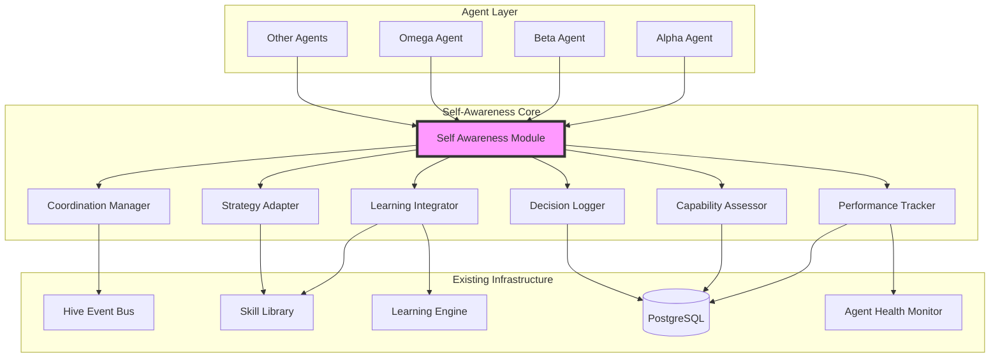

# Design Document: Self-Aware Agents

## Overview

This design document describes the architecture and implementation approach for integrating self-awareness capabilities into the Vulagent penetration testing system. The self-awareness layer will enable agents to monitor their own performance, understand their capabilities, adapt strategies dynamically, explain decisions, coordinate intelligently, and learn from experiences.

The design builds upon existing infrastructure including:
- `backend/core/agent_health_monitor.py` - Health monitoring foundation
- `backend/core/learning_engine.py` - Learning system integration
- `backend/core/skill_library.py` - Skill management
- `backend/core/self_healing_engine.py` - Self-healing capabilities
- `backend/core/hive.py` - Event bus for communication
- `backend/core/state.py` - State management

The implementation follows a modular architecture where self-awareness capabilities are added as mixins to existing agent classes, ensuring backward compatibility and gradual rollout capability.

## Architecture

### High-Level Architecture



### Component Architecture

The self-awareness system consists of seven core components that work together:

1. **Self_Awareness_Module**: Central coordinator that integrates all self-awareness capabilities
2. **Performance_Tracker**: Monitors execution metrics, resource usage, and detects stuck states
3. **Capability_Assessor**: Maintains skill proficiency maps and evaluates task suitability
4. **Strategy_Adapter**: Implements adaptive behavior when obstacles are encountered
5. **Decision_Logger**: Records decision rationale and confidence levels
6. **Coordination_Manager**: Facilitates inter-agent communication and task delegation
7. **Learning_Integrator**: Updates agent knowledge based on outcomes

### Integration Pattern

Self-awareness capabilities are added to agents using a mixin pattern:

```python
class SelfAwareAgentMixin:
    """Mixin that adds self-awareness capabilities to agents"""
    
    def __init__(self):
        self.self_awareness = SelfAwarenessModule(agent=self)
        self.performance_tracker = self.self_awareness.performance_tracker
        self.capability_assessor = self.self_awareness.capability_assessor
        # ... other components
    
    def execute_with_awareness(self, action, context):
        """Execute action with full self-awareness"""
        # Pre-execution: assess capability and log decision
        # Execution: track performance
        # Post-execution: learn and adapt
```

Existing agents inherit from this mixin:

```python
class AlphaAgent(BaseAgent, SelfAwareAgentMixin):
    """Alpha agent with self-awareness capabilities"""
    pass
```

## Components and Interfaces

### 1. Self_Awareness_Module

**Purpose**: Central coordinator for all self-awareness capabilities

**Interface**:
```python
class SelfAwarenessModule:
    def __init__(self, agent: BaseAgent, config: SelfAwarenessConfig):
        """Initialize with agent reference and configuration"""
        
    def before_action(self, action: Action, context: Dict) -> ActionDecision:
        """Called before agent executes an action
        
        Returns:
            ActionDecision with should_execute, confidence, rationale
        """
        
    def after_action(self, action: Action, result: ActionResult) -> None:
        """Called after agent completes an action"""
        
    def get_metrics(self) -> SelfAwarenessMetrics:
        """Get current self-awareness metrics"""
        
    def is_stuck(self) -> bool:
        """Check if agent is in stuck state"""
        
    def adapt_strategy(self) -> AdaptationResult:
        """Trigger strategic adaptation"""
```

**Key Responsibilities**:
- Coordinate all self-awareness components
- Provide unified interface for agents
- Manage component lifecycle
- Handle feature flag checks

### 2. Performance_Tracker

**Purpose**: Monitor agent performance and resource usage

**Interface**:
```python
class PerformanceTracker:
    def record_action_start(self, action: Action) -> str:
        """Record action start, return tracking_id"""
        
    def record_action_end(self, tracking_id: str, result: ActionResult) -> None:
        """Record action completion with outcome"""
        
    def get_success_rate(self, action_type: str, window_minutes: int = 60) -> float:
        """Get success rate for action type in time window"""
        
    def get_resource_usage(self) -> ResourceMetrics:
        """Get current CPU, memory, API call metrics"""
        
    def detect_stuck_state(self) -> Optional[StuckStateInfo]:
        """Detect if agent is stuck (3+ consecutive failures)"""
        
    def get_metrics_summary(self) -> PerformanceMetrics:
        """Get comprehensive performance summary"""
```

**Data Structures**:
```python
@dataclass
class ActionRecord:
    tracking_id: str
    agent_id: str
    action_type: str
    start_time: datetime
    end_time: Optional[datetime]
    success: Optional[bool]
    cpu_usage: float
    memory_mb: float
    api_calls: int
    
@dataclass
class ResourceMetrics:
    cpu_percent: float
    memory_mb: float
    api_calls_per_minute: int
    
@dataclass
class StuckStateInfo:
    action_type: str
    consecutive_failures: int
    first_failure_time: datetime
    last_failure_time: datetime
```

**Storage**: Metrics are batched in memory and persisted to PostgreSQL every 30 seconds

### 3. Capability_Assessor

**Purpose**: Maintain and evaluate agent skill proficiency

**Interface**:
```python
class CapabilityAssessor:
    def get_proficiency(self, skill: str) -> float:
        """Get proficiency score (0.0-1.0) for skill"""
        
    def update_proficiency(self, skill: str, outcome: bool, context: Dict) -> None:
        """Update proficiency based on action outcome"""
        
    def can_perform(self, skill: str, min_proficiency: float = 0.5) -> bool:
        """Check if agent can perform skill at required level"""
        
    def check_prerequisites(self, action: Action, context: Dict) -> PrerequisiteCheck:
        """Verify prerequisites for action are satisfied"""
        
    def get_skill_map(self) -> Dict[str, float]:
        """Get complete skill proficiency map"""
        
    def suggest_delegation(self, skill: str) -> Optional[str]:
        """Suggest better agent for skill if current proficiency is low"""
```

**Proficiency Update Algorithm**:
```python
def update_proficiency(skill: str, outcome: bool, current_score: float) -> float:
    """
    Update proficiency using exponential moving average
    
    Success: score += (1.0 - score) * learning_rate
    Failure: score -= score * learning_rate
    
    learning_rate = 0.1 (configurable)
    """
    learning_rate = 0.1
    if outcome:
        return current_score + (1.0 - current_score) * learning_rate
    else:
        return current_score - current_score * learning_rate
```

**Storage**: Proficiency scores persisted to PostgreSQL `agent_proficiency` table

### 4. Strategy_Adapter

**Purpose**: Implement adaptive behavior when obstacles encountered

**Interface**:
```python
class StrategyAdapter:
    def should_adapt(self, context: AdaptationContext) -> bool:
        """Determine if adaptation is needed"""
        
    def select_adaptation(self, context: AdaptationContext) -> AdaptationStrategy:
        """Select appropriate adaptation strategy"""
        
    def apply_adaptation(self, strategy: AdaptationStrategy) -> AdaptationResult:
        """Apply selected adaptation strategy"""
        
    def detect_diminishing_returns(self, action_type: str) -> bool:
        """Detect if action is producing diminishing returns"""
        
    def adjust_for_defenses(self, defense_type: str) -> DefenseAdaptation:
        """Adjust strategy for WAF, rate limiting, etc."""
```

**Adaptation Strategies**:
```python
class AdaptationStrategy(Enum):
    RETRY_WITH_BACKOFF = "retry_with_backoff"
    SWITCH_TECHNIQUE = "switch_technique"
    DELEGATE_TO_PEER = "delegate_to_peer"
    REDUCE_AGGRESSION = "reduce_aggression"
    CHANGE_PARAMETERS = "change_parameters"
    ABORT_AND_REPORT = "abort_and_report"
```

**Adaptation Decision Logic**:
1. If stuck (3+ failures): Try SWITCH_TECHNIQUE or DELEGATE_TO_PEER
2. If rate limited: Apply REDUCE_AGGRESSION with exponential backoff
3. If WAF detected: Apply CHANGE_PARAMETERS (encoding, payloads)
4. If diminishing returns: Apply ABORT_AND_REPORT
5. If transient error: Apply RETRY_WITH_BACKOFF

### 5. Decision_Logger

**Purpose**: Record decision rationale and confidence levels

**Interface**:
```python
class DecisionLogger:
    def log_decision(self, decision: Decision) -> str:
        """Log decision with rationale, return decision_id"""
        
    def log_alternative_rejected(self, decision_id: str, alternative: Action, reason: str) -> None:
        """Log why an alternative was not chosen"""
        
    def get_decision_chain(self, finding_id: str) -> List[Decision]:
        """Get complete decision chain for a finding"""
        
    def query_decisions(self, filters: DecisionFilters) -> List[Decision]:
        """Query decisions with filters"""
        
    def format_for_report(self, decision_id: str) -> str:
        """Format decision rationale for human-readable report"""
```

**Data Structures**:
```python
@dataclass
class Decision:
    decision_id: str
    agent_id: str
    timestamp: datetime
    action: Action
    rationale: str
    confidence: float  # 0.0-1.0
    alternatives_considered: List[Action]
    context: Dict
    
@dataclass
class DecisionFilters:
    agent_id: Optional[str]
    action_type: Optional[str]
    start_time: Optional[datetime]
    end_time: Optional[datetime]
    min_confidence: Optional[float]
```

**Storage**: Decisions persisted to PostgreSQL `agent_decisions` table with full-text search on rationale

### 6. Coordination_Manager

**Purpose**: Facilitate inter-agent communication and task delegation

**Interface**:
```python
class CoordinationManager:
    def broadcast_status(self, status: AgentStatus) -> None:
        """Broadcast agent status to Hive"""
        
    def delegate_task(self, task: Task, target_agent: Optional[str] = None) -> DelegationResult:
        """Delegate task to more capable agent"""
        
    def request_assistance(self, problem: Problem) -> AssistanceResponse:
        """Request assistance from peer agents"""
        
    def update_meta_awareness(self, agent_id: str, capabilities: Dict) -> None:
        """Update Omega's meta-awareness (Omega only)"""
        
    def select_best_agent(self, task: Task) -> str:
        """Select best agent for task based on proficiency"""
```

**Hive Message Types**:
```python
class HiveMessageType(Enum):
    STATUS_UPDATE = "status_update"
    CAPABILITY_BROADCAST = "capability_broadcast"
    TASK_DELEGATION = "task_delegation"
    ASSISTANCE_REQUEST = "assistance_request"
    LEARNING_SHARE = "learning_share"
```

**Delegation Algorithm**:
1. Evaluate current agent proficiency for task
2. If proficiency < 0.5, query Hive for capable agents
3. Select agent with highest proficiency and available capacity
4. Send delegation message via Hive
5. Log delegation decision with rationale

### 7. Learning_Integrator

**Purpose**: Update agent knowledge based on outcomes

**Interface**:
```python
class LearningIntegrator:
    def learn_from_outcome(self, action: Action, outcome: ActionResult) -> None:
        """Update learning based on action outcome"""
        
    def save_successful_strategy(self, strategy: Strategy, context: Dict) -> None:
        """Save successful strategy to skill library"""
        
    def mark_failed_approach(self, approach: Approach, context: Dict) -> None:
        """Mark approach as ineffective"""
        
    def share_learning(self, learning: Learning) -> None:
        """Share learning with other agents via Hive"""
        
    def apply_shared_learning(self, learning: Learning) -> None:
        """Apply learning shared by another agent"""
```

**Learning Update Flow**:
1. Action completes with outcome
2. Update proficiency score via Capability_Assessor
3. If success and novel: Save strategy to Skill_Library
4. If failure: Mark approach context for avoidance
5. Broadcast learning to Hive for peer agents
6. Persist learning to database

**Integration with Existing Learning_Engine**:
```python
# Learning_Integrator wraps existing Learning_Engine
class LearningIntegrator:
    def __init__(self, learning_engine: LearningEngine):
        self.learning_engine = learning_engine
        
    def learn_from_outcome(self, action, outcome):
        # Update proficiency
        self.capability_assessor.update_proficiency(...)
        
        # Delegate to existing learning engine
        self.learning_engine.record_outcome(action, outcome)
        
        # Add self-awareness specific learning
        if outcome.success and outcome.novel:
            self.save_successful_strategy(...)
```

## Data Models

### Database Schema

**agent_proficiency table**:
```sql
CREATE TABLE agent_proficiency (
    id SERIAL PRIMARY KEY,
    agent_id VARCHAR(50) NOT NULL,
    skill VARCHAR(100) NOT NULL,
    proficiency_score FLOAT NOT NULL CHECK (proficiency_score >= 0 AND proficiency_score <= 1),
    last_updated TIMESTAMP NOT NULL DEFAULT NOW(),
    total_attempts INTEGER NOT NULL DEFAULT 0,
    successful_attempts INTEGER NOT NULL DEFAULT 0,
    UNIQUE(agent_id, skill)
);

CREATE INDEX idx_agent_proficiency_agent ON agent_proficiency(agent_id);
CREATE INDEX idx_agent_proficiency_skill ON agent_proficiency(skill);
```

**agent_performance table**:
```sql
CREATE TABLE agent_performance (
    id SERIAL PRIMARY KEY,
    agent_id VARCHAR(50) NOT NULL,
    tracking_id VARCHAR(100) NOT NULL UNIQUE,
    action_type VARCHAR(100) NOT NULL,
    start_time TIMESTAMP NOT NULL,
    end_time TIMESTAMP,
    success BOOLEAN,
    cpu_usage FLOAT,
    memory_mb FLOAT,
    api_calls INTEGER,
    error_message TEXT,
    created_at TIMESTAMP NOT NULL DEFAULT NOW()
);

CREATE INDEX idx_agent_performance_agent ON agent_performance(agent_id);
CREATE INDEX idx_agent_performance_time ON agent_performance(start_time DESC);
CREATE INDEX idx_agent_performance_action ON agent_performance(action_type);
```

**agent_decisions table**:
```sql
CREATE TABLE agent_decisions (
    id SERIAL PRIMARY KEY,
    decision_id VARCHAR(100) NOT NULL UNIQUE,
    agent_id VARCHAR(50) NOT NULL,
    timestamp TIMESTAMP NOT NULL,
    action_type VARCHAR(100) NOT NULL,
    rationale TEXT NOT NULL,
    confidence FLOAT NOT NULL CHECK (confidence >= 0 AND confidence <= 1),
    alternatives_considered JSONB,
    context JSONB,
    finding_id VARCHAR(100),
    created_at TIMESTAMP NOT NULL DEFAULT NOW()
);

CREATE INDEX idx_agent_decisions_agent ON agent_decisions(agent_id);
CREATE INDEX idx_agent_decisions_time ON agent_decisions(timestamp DESC);
CREATE INDEX idx_agent_decisions_finding ON agent_decisions(finding_id);
CREATE INDEX idx_agent_decisions_rationale_fts ON agent_decisions USING gin(to_tsvector('english', rationale));
```

**agent_adaptations table**:
```sql
CREATE TABLE agent_adaptations (
    id SERIAL PRIMARY KEY,
    agent_id VARCHAR(50) NOT NULL,
    timestamp TIMESTAMP NOT NULL,
    trigger_reason VARCHAR(100) NOT NULL,
    strategy_applied VARCHAR(100) NOT NULL,
    success BOOLEAN,
    context JSONB,
    created_at TIMESTAMP NOT NULL DEFAULT NOW()
);

CREATE INDEX idx_agent_adaptations_agent ON agent_adaptations(agent_id);
CREATE INDEX idx_agent_adaptations_time ON agent_adaptations(timestamp DESC);
```

### Configuration Model

```python
@dataclass
class SelfAwarenessConfig:
    """Configuration for self-awareness features"""
    
    # Feature flags
    enabled: bool = True
    performance_tracking_enabled: bool = True
    capability_assessment_enabled: bool = True
    strategy_adaptation_enabled: bool = True
    decision_logging_enabled: bool = True
    coordination_enabled: bool = True
    learning_enabled: bool = True
    
    # Performance thresholds
    stuck_state_threshold: int = 3  # consecutive failures
    diminishing_returns_threshold: int = 3  # attempts with no new findings
    max_introspection_overhead_percent: float = 5.0
    
    # Proficiency settings
    initial_proficiency: float = 0.5
    min_proficiency_for_task: float = 0.5
    proficiency_learning_rate: float = 0.1
    
    # Adaptation settings
    adaptation_cooldown_seconds: int = 60
    max_adaptation_attempts: int = 3
    
    # Performance settings
    metrics_batch_interval_seconds: int = 30
    metrics_retention_days: int = 90
    
    # Coordination settings
    delegation_enabled: bool = True
    broadcast_interval_seconds: int = 10
```

## Error Handling

### Error Categories

1. **Introspection Failures**: Errors in self-awareness components
2. **Database Failures**: Persistence errors
3. **Communication Failures**: Hive message delivery errors
4. **Resource Exhaustion**: Memory or CPU limits exceeded

### Error Handling Strategy

**Principle**: Self-awareness failures must never crash agents

```python
class SelfAwarenessModule:
    def before_action(self, action, context):
        try:
            # Perform self-awareness checks
            decision = self._make_decision(action, context)
            return decision
        except Exception as e:
            # Log error but allow action to proceed
            logger.error(f"Self-awareness error in before_action: {e}")
            return ActionDecision(
                should_execute=True,
                confidence=0.5,  # default confidence
                rationale="Self-awareness unavailable, proceeding with default behavior"
            )
```

**Database Error Handling**:
```python
class PerformanceTracker:
    def __init__(self):
        self.pending_metrics = []  # In-memory queue
        
    def record_action_end(self, tracking_id, result):
        try:
            # Try immediate write
            self.db.insert(...)
        except DatabaseError as e:
            # Queue for retry
            self.pending_metrics.append((tracking_id, result))
            logger.warning(f"Database write failed, queued for retry: {e}")
            
    def flush_pending_metrics(self):
        """Retry pending metrics with exponential backoff"""
        for metric in self.pending_metrics[:]:
            try:
                self.db.insert(metric)
                self.pending_metrics.remove(metric)
            except DatabaseError:
                # Will retry on next flush
                pass
```

**Resource Exhaustion Handling**:
```python
class SelfAwarenessModule:
    def check_overhead(self):
        """Monitor introspection overhead"""
        overhead_percent = (self.introspection_time / self.total_time) * 100
        
        if overhead_percent > self.config.max_introspection_overhead_percent:
            logger.warning(f"Introspection overhead {overhead_percent}% exceeds limit")
            # Reduce introspection frequency
            self.throttle_introspection()
```

## Testing Strategy

The self-aware agents feature will be validated through a comprehensive dual testing approach combining unit tests for specific scenarios and property-based tests for universal correctness properties.

### Testing Approach

**Unit Tests**: Focus on specific examples, edge cases, and integration points
- Component initialization and configuration
- Error handling and fallback behavior
- Database operations and retry logic
- Hive message formatting and delivery
- Feature flag behavior
- Edge cases (empty data, null values, boundary conditions)

**Property-Based Tests**: Verify universal properties across all inputs
- Proficiency scores always remain in valid range [0.0, 1.0]
- Performance metrics are internally consistent
- Decision logs are complete and queryable
- Adaptation strategies preserve agent functionality
- Learning updates are monotonic and bounded

**Integration Tests**: Verify component interactions
- End-to-end agent execution with self-awareness
- Multi-agent coordination scenarios
- Database persistence and retrieval
- Hive communication between agents

### Property-Based Testing Configuration

All property-based tests will use the **Hypothesis** library for Python and will be configured to run a minimum of 100 iterations per test to ensure comprehensive input coverage.

Each property test will include a comment tag referencing the design document property:
```python
# Feature: self-aware-agents, Property 1: Proficiency bounds preservation
@given(st.floats(min_value=0.0, max_value=1.0), st.booleans())
@settings(max_examples=100)
def test_proficiency_update_preserves_bounds(initial_score, outcome):
    ...
```

### Test Coverage Requirements

- Minimum 80% code coverage for all self-awareness components
- 100% coverage for critical paths (proficiency updates, decision logging)
- All error handling paths must be tested
- All database operations must have rollback tests
- All Hive messages must have serialization tests


## Correctness Properties

*A property is a characteristic or behavior that should hold true across all valid executions of a system—essentially, a formal statement about what the system should do. Properties serve as the bridge between human-readable specifications and machine-verifiable correctness guarantees.*

### Property Reflection

After analyzing all acceptance criteria, several properties can be consolidated to eliminate redundancy:

**Consolidations Made**:
1. Properties 1.1, 1.4, and 4.1 all relate to recording completeness - consolidated into Property 1
2. Properties 2.1 and 6.1/6.2 all relate to proficiency updates - consolidated into Property 2
3. Properties 1.5, 2.4, and 6.5 all relate to database round-trips - consolidated into Property 3
4. Properties 4.2 and confidence validation - kept as Property 4 (unique validation concern)
5. Properties 3.1 and 3.5 relate to adaptation lifecycle - consolidated into Property 5
6. Properties 5.1, 5.4, and 5.5 relate to delegation logic - consolidated into Property 6
7. Properties 7.4 and 7.5 relate to error resilience - consolidated into Property 7

### Core Properties

**Property 1: Action Recording Completeness**

*For any* agent action execution, the system SHALL record a complete entry including action type, outcome, resource metrics, and decision rationale.

**Validates: Requirements 1.1, 1.4, 4.1**

**Property 2: Proficiency Bounds Preservation**

*For any* proficiency score update based on action outcomes, the resulting proficiency score SHALL remain within the valid range [0.0, 1.0], and successful outcomes SHALL increase proficiency while failures SHALL decrease proficiency.

**Validates: Requirements 2.1, 6.1, 6.2**

**Property 3: Persistence Round-Trip Consistency**

*For any* self-awareness data (performance metrics, proficiency scores, decisions, learning data), persisting to the database then retrieving SHALL produce equivalent data.

**Validates: Requirements 1.5, 2.4, 6.5**

**Property 4: Confidence Level Validity**

*For any* decision logged by an agent, the confidence level SHALL be a valid float in the range [0.0, 1.0].

**Validates: Requirements 4.2**

**Property 5: Adaptation Strategy Application**

*For any* stuck state or obstacle encountered, the Strategy_Adapter SHALL select an adaptation strategy, apply it, log the decision with rationale, and if successful, save the strategy to the Skill_Library.

**Validates: Requirements 3.1, 3.5**

**Property 6: Intelligent Task Delegation**

*For any* task assignment when the current agent's proficiency is below the minimum threshold, the Coordination_Manager SHALL delegate to an agent with higher proficiency, broadcast the delegation via Hive, and log the delegation decision with rationale.

**Validates: Requirements 5.1, 5.4, 5.5**

**Property 7: Error Resilience**

*For any* introspection operation failure, the system SHALL log the error, continue agent operations without crashing, and maintain introspection overhead below 5% of total execution time.

**Validates: Requirements 7.4, 7.5**

**Property 8: Stuck State Detection**

*For any* sequence of agent actions, when exactly 3 consecutive failures of the same action type occur, the Performance_Tracker SHALL detect and flag a stuck state.

**Validates: Requirements 1.3**

**Property 9: Resource Metrics Capture**

*For any* agent operation execution, the Performance_Tracker SHALL capture resource metrics (CPU, memory, API calls) with all values being non-null and within valid ranges.

**Validates: Requirements 1.2**

**Property 10: Prerequisite Verification**

*For any* action with defined prerequisites, the Capability_Assessor SHALL correctly identify whether prerequisites are satisfied based on the current context.

**Validates: Requirements 2.3**

**Property 11: Skill Map Completeness**

*For any* agent with tracked skills, querying the skill proficiency map SHALL return entries for all skills the agent has attempted.

**Validates: Requirements 2.5**

**Property 12: Diminishing Returns Detection**

*For any* action sequence, when 3 or more consecutive attempts produce no new findings, the Strategy_Adapter SHALL terminate the action sequence.

**Validates: Requirements 3.2**

**Property 13: Defense Adaptation**

*For any* encounter with rate limiting or WAF responses, the Strategy_Adapter SHALL reduce request frequency in subsequent attempts.

**Validates: Requirements 3.3**

**Property 14: Adaptation Logging Completeness**

*For any* adaptation decision, the Decision_Logger SHALL contain an entry with timestamp, strategy applied, and rationale.

**Validates: Requirements 3.4**

**Property 15: Alternative Rejection Logging**

*For any* decision where multiple options were considered, the Decision_Logger SHALL record why each rejected alternative was not chosen.

**Validates: Requirements 4.3**

**Property 16: Decision Query Filtering**

*For any* decision log query with filters (agent, timestamp, action type), the returned results SHALL match all specified filter criteria.

**Validates: Requirements 4.4**

**Property 17: Report Rationale Inclusion**

*For any* significant finding in a generated report, the report SHALL include the decision rationale in human-readable format.

**Validates: Requirements 4.5**

**Property 18: State Change Broadcasting**

*For any* agent state change, the Coordination_Manager SHALL broadcast updated status and capability information via the Hive.

**Validates: Requirements 5.2**

**Property 19: Meta-Awareness Consistency**

*For any* capability broadcast received by Omega, Omega's meta-awareness SHALL accurately reflect the broadcasting agent's current state and proficiency levels.

**Validates: Requirements 5.3**

**Property 20: Failed Approach Marking**

*For any* approach that fails repeatedly (3+ times in similar contexts), the Learning_Integrator SHALL mark it as ineffective to prevent future repetition.

**Validates: Requirements 6.4**

**Property 21: Strategy Context Preservation**

*For any* successful adaptation strategy saved to the Skill_Library, retrieving it SHALL return the strategy with all context metadata intact.

**Validates: Requirements 6.3**

**Property 22: Hive Communication Exclusivity**

*For any* inter-agent communication, all messages SHALL be sent through the Hive event bus with no direct agent-to-agent calls.

**Validates: Requirements 7.2**

**Property 23: API Metrics Completeness**

*For any* agent with self-awareness enabled, querying the metrics API SHALL return success rates, resource usage, and stuck state indicators.

**Validates: Requirements 8.2**

**Property 24: Audit Trail Completeness**

*For any* finding or action, querying the audit trail SHALL return the complete decision chain including all intermediate decisions.

**Validates: Requirements 8.4**

**Property 25: Database Retry with Backoff**

*For any* database operation failure, the system SHALL queue the operation locally and retry with exponentially increasing delays between attempts.

**Validates: Requirements 9.2**

### Edge Case Properties

**Property 26: Empty Proficiency Map Handling**

*For any* newly initialized agent with no skill history, querying the proficiency map SHALL return an empty map without errors.

**Validates: Requirements 2.5 (edge case)**

**Property 27: Zero Resource Usage Handling**

*For any* action that completes instantly, resource metrics SHALL be recorded with zero or near-zero values without causing errors.

**Validates: Requirements 1.2 (edge case)**

**Property 28: Concurrent Adaptation Handling**

*For any* agent experiencing multiple simultaneous stuck states, the Strategy_Adapter SHALL handle adaptations sequentially without race conditions.

**Validates: Requirements 3.1 (edge case)**

### Example-Based Properties

The following properties are best validated through specific examples rather than property-based testing:

**Property 29: Backward Compatibility with Feature Flag Disabled**

When self-awareness features are disabled via feature flag, the system SHALL execute scans identically to the current implementation (excluding self-awareness data).

**Validates: Requirements 10.1**

**Property 30: Independent Agent Type Rollout**

The system SHALL support enabling self-awareness for specific agent types (e.g., Alpha, Beta) while leaving others (e.g., Gamma, Delta) unaffected.

**Validates: Requirements 10.3**

**Property 31: Batch Write Timing**

The Performance_Tracker SHALL aggregate metrics in memory and perform batch writes to the database at 30-second intervals.

**Validates: Requirements 9.4**

**Property 32: Scalability Under Load**

The system SHALL support 100 or more concurrent agent instances with self-awareness enabled without degradation.

**Validates: Requirements 9.1**

**Property 33: Tracing Integration**

All self-awareness operations SHALL create trace spans using the existing tracing infrastructure.

**Validates: Requirements 8.5**

**Property 34: Feature Flag Behavior**

The system SHALL provide feature flags to enable or disable self-awareness capabilities per agent type, with flags correctly controlling behavior.

**Validates: Requirements 8.1**

**Property 35: Database Schema Compliance**

All self-awareness data persistence SHALL use the existing PostgreSQL database with established schema conventions.

**Validates: Requirements 7.3**

**Property 36: Base Class Integration**

The Self_Awareness_Module SHALL integrate with the existing agent base class without breaking existing agent tests.

**Validates: Requirements 7.1**

**Property 37: Default Behavior Preservation**

Agents created without explicit self-awareness configuration SHALL behave identically to non-self-aware agents.

**Validates: Requirements 10.2**

**Property 38: Skill Library Migration**

When upgrading to self-aware agents, existing skill library data SHALL be migrated without data loss.

**Validates: Requirements 10.4**

**Property 39: API Compatibility**

All existing API endpoints SHALL continue functioning with self-awareness enabled, and new self-awareness endpoints SHALL be additive.

**Validates: Requirements 10.5**


## Implementation Phases

The implementation will be rolled out in phases to manage complexity and enable incremental validation:

### Phase 1: Core Infrastructure (Foundation)
- Database schema creation
- Self_Awareness_Module base implementation
- Performance_Tracker implementation
- Feature flag integration
- Basic unit tests

### Phase 2: Capability and Learning (Intelligence)
- Capability_Assessor implementation
- Learning_Integrator implementation
- Integration with existing Learning_Engine and Skill_Library
- Proficiency update algorithms
- Property-based tests for proficiency bounds

### Phase 3: Adaptation and Decision Logging (Behavior)
- Strategy_Adapter implementation
- Decision_Logger implementation
- Adaptation strategy selection logic
- Decision rationale formatting
- Property-based tests for adaptation

### Phase 4: Coordination (Collaboration)
- Coordination_Manager implementation
- Hive message integration
- Task delegation logic
- Meta-awareness for Omega
- Integration tests for multi-agent scenarios

### Phase 5: API and Observability (Visibility)
- REST API endpoints for metrics
- Dashboard integration
- Audit trail queries
- Tracing integration
- End-to-end tests

### Phase 6: Performance Optimization and Rollout (Production)
- Performance profiling and optimization
- Batch write optimization
- Overhead monitoring
- Gradual rollout to production
- Load testing with 100+ agents

## Performance Considerations

### Overhead Minimization

**Target**: <5% introspection overhead

**Strategies**:
1. **Batch Database Writes**: Aggregate metrics in memory, write every 30 seconds
2. **Async Logging**: Decision logging happens asynchronously to avoid blocking
3. **Lazy Evaluation**: Proficiency calculations only when needed
4. **Caching**: Cache frequently accessed proficiency scores
5. **Sampling**: Under high load, sample introspection operations (e.g., log every 10th decision)

**Monitoring**:
```python
class OverheadMonitor:
    def measure_overhead(self):
        """Calculate introspection overhead percentage"""
        overhead = (introspection_time / total_time) * 100
        if overhead > 5.0:
            self.trigger_throttling()
```

### Database Optimization

**Indexing Strategy**:
- Index on `agent_id` for all tables (most common query pattern)
- Index on `timestamp` for time-range queries
- Index on `action_type` for performance analysis
- Full-text search index on `rationale` for audit queries

**Query Optimization**:
- Use connection pooling (existing PostgreSQL pool)
- Batch inserts for performance metrics
- Prepared statements for repeated queries
- Query result caching for dashboard

### Memory Management

**Bounded Queues**:
```python
class PerformanceTracker:
    def __init__(self):
        self.pending_metrics = deque(maxlen=1000)  # Bounded queue
```

**Periodic Cleanup**:
- Flush pending metrics every 30 seconds
- Clear old in-memory data after persistence
- Limit decision log cache size

## Security Considerations

### Data Protection

**Sensitive Data Handling**:
- Decision rationales may contain target information
- Sanitize rationales before logging
- Apply existing access controls to self-awareness APIs
- Encrypt sensitive fields in database

**Access Control**:
- Self-awareness APIs require same authentication as existing APIs
- Audit trail queries require elevated permissions
- Feature flags controlled by admin role only

### Injection Prevention

**Query Safety**:
- Use parameterized queries for all database operations
- Validate all input to decision logger
- Sanitize context data before persistence

**Hive Message Validation**:
- Validate message structure before processing
- Verify sender identity for delegation messages
- Rate limit broadcasts to prevent flooding

## Monitoring and Observability

### Metrics to Track

**System Health**:
- Introspection overhead percentage
- Database write latency
- Hive message delivery rate
- Agent uptime with self-awareness enabled

**Agent Performance**:
- Success rate per agent per action type
- Proficiency score trends over time
- Adaptation frequency and success rate
- Stuck state occurrences

**Learning Effectiveness**:
- Proficiency improvement rate
- Strategy reuse frequency
- Failed approach avoidance rate

### Alerting

**Critical Alerts**:
- Introspection overhead >5% for >5 minutes
- Database write failures >10 in 1 minute
- Agent crash rate increase
- Stuck state not resolving after 3 adaptations

**Warning Alerts**:
- Proficiency scores decreasing consistently
- High adaptation frequency (>10/minute per agent)
- Decision log query latency >1 second

### Dashboards

**Agent Performance Dashboard**:
- Real-time success rates per agent
- Resource usage trends
- Stuck state indicators
- Recent adaptations

**Learning Dashboard**:
- Proficiency score heatmap (agents × skills)
- Strategy effectiveness rankings
- Learning velocity metrics

**Coordination Dashboard**:
- Task delegation flow visualization
- Agent capability matrix
- Hive message throughput

## Migration Strategy

### Database Migration

**Schema Creation**:
```sql
-- Run migrations in transaction
BEGIN;

-- Create tables
CREATE TABLE agent_proficiency (...);
CREATE TABLE agent_performance (...);
CREATE TABLE agent_decisions (...);
CREATE TABLE agent_adaptations (...);

-- Create indexes
CREATE INDEX idx_agent_proficiency_agent ON agent_proficiency(agent_id);
-- ... other indexes

-- Migrate existing skill library data
INSERT INTO agent_proficiency (agent_id, skill, proficiency_score, ...)
SELECT agent_id, skill_name, 0.5, NOW()
FROM skill_library
WHERE agent_id IS NOT NULL;

COMMIT;
```

**Rollback Plan**:
- Keep migration scripts reversible
- Backup database before migration
- Test migration on staging environment

### Code Migration

**Gradual Integration**:
1. Deploy Self_Awareness_Module with feature flags disabled
2. Enable for Alpha agent only in staging
3. Monitor for 24 hours
4. Enable for Beta, Gamma in staging
5. Enable for all agents in staging
6. Enable for Alpha in production
7. Gradual rollout to all production agents

**Compatibility Layer**:
```python
class BaseAgent:
    def __init__(self):
        # Existing initialization
        
        # Add self-awareness if enabled
        if feature_flags.is_enabled('self_awareness', self.agent_type):
            self._init_self_awareness()
    
    def _init_self_awareness(self):
        """Initialize self-awareness components"""
        self.self_awareness = SelfAwarenessModule(self)
```

## Configuration Management

### Feature Flags

```python
# config/feature_flags.py
SELF_AWARENESS_FLAGS = {
    'self_awareness_enabled': False,  # Master switch
    'self_awareness_alpha': False,
    'self_awareness_beta': False,
    'self_awareness_gamma': False,
    # ... other agents
    'performance_tracking': True,
    'capability_assessment': True,
    'strategy_adaptation': True,
    'decision_logging': True,
    'coordination': True,
    'learning': True,
}
```

### Environment-Specific Configuration

```python
# config/self_awareness.py
DEVELOPMENT = SelfAwarenessConfig(
    enabled=True,
    metrics_batch_interval_seconds=10,  # Faster feedback
    metrics_retention_days=7,
)

STAGING = SelfAwarenessConfig(
    enabled=True,
    metrics_batch_interval_seconds=30,
    metrics_retention_days=30,
)

PRODUCTION = SelfAwarenessConfig(
    enabled=False,  # Start disabled
    metrics_batch_interval_seconds=30,
    metrics_retention_days=90,
    max_introspection_overhead_percent=5.0,
)
```

## Dependencies

### New Dependencies

- **hypothesis**: Property-based testing library (dev dependency)
- No new runtime dependencies (uses existing infrastructure)

### Existing Dependencies

- **PostgreSQL**: Database for persistence
- **Redis**: Used by existing Hive event bus
- **psycopg2**: PostgreSQL adapter
- **SQLAlchemy**: ORM (if used by existing code)

## Risks and Mitigations

### Risk 1: Performance Overhead

**Risk**: Self-awareness operations slow down scans significantly

**Mitigation**:
- Implement overhead monitoring from day 1
- Use batching and async operations
- Implement throttling when overhead exceeds threshold
- Make all components optional via feature flags

### Risk 2: Database Bottleneck

**Risk**: High-frequency writes overwhelm database

**Mitigation**:
- Batch writes every 30 seconds
- Use connection pooling
- Implement local queuing with retry
- Monitor database performance metrics

### Risk 3: Hive Message Flooding

**Risk**: Status broadcasts overwhelm event bus

**Mitigation**:
- Rate limit broadcasts (max 1 per 10 seconds per agent)
- Use message batching
- Implement backpressure handling
- Monitor Hive throughput

### Risk 4: Complexity Creep

**Risk**: Self-awareness adds too much complexity

**Mitigation**:
- Keep components modular and independent
- Comprehensive unit tests for each component
- Clear documentation and examples
- Gradual rollout with monitoring

### Risk 5: Data Privacy

**Risk**: Decision logs expose sensitive target information

**Mitigation**:
- Sanitize rationales before logging
- Apply access controls to audit APIs
- Encrypt sensitive fields
- Implement data retention policies

## Success Criteria

The self-aware agents feature will be considered successful when:

1. **Performance**: Introspection overhead consistently <5% in production
2. **Reliability**: Agent uptime ≥95% with self-awareness enabled
3. **Effectiveness**: 30% reduction in scan time within 3 months
4. **Quality**: 40% reduction in false positives within 3 months
5. **Explainability**: 90% of findings include decision rationale
6. **Learning**: 50% improvement in vulnerability detection rate over 3 months
7. **Adoption**: Self-awareness enabled for all agents in production
8. **Stability**: Zero crashes caused by self-awareness components

## Future Enhancements

### Phase 2 Features (Post-MVP)

1. **Advanced Learning**:
   - Transfer learning between agents
   - Reinforcement learning for strategy selection
   - Anomaly detection in agent behavior

2. **Enhanced Coordination**:
   - Multi-agent planning and negotiation
   - Dynamic team formation based on task requirements
   - Conflict resolution for competing objectives

3. **Predictive Capabilities**:
   - Predict scan duration based on target characteristics
   - Predict vulnerability likelihood before testing
   - Recommend optimal agent assignment for new targets

4. **Explainable AI**:
   - Visual decision trees for complex decisions
   - Counterfactual explanations ("what if" scenarios)
   - Confidence calibration and uncertainty quantification

5. **Self-Optimization**:
   - Automatic hyperparameter tuning
   - Self-modifying strategies
   - Meta-learning across multiple scans

