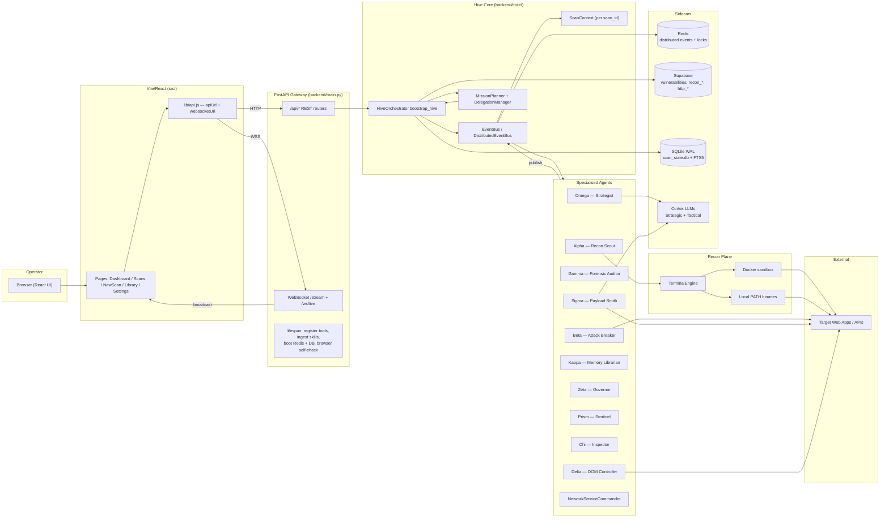

# Vigilagent — Architecture Blueprint

> Senior‑engineer onboarding document. Every claim in this doc cites a file
> and a line range so a new engineer can read the source alongside the prose.
> The companion docs in this folder are: `SYSTEM_DESIGN.md`, `DATA_FLOW.md`,
> `CLEAN_ARCH_TARGET.md`, `API.md`, and `DB_SCHEMA.md`.

---

## 1. The 30‑second elevator pitch

Vigilagent is a single‑binary asynchronous penetration‑testing platform that
combines:

- **A FastAPI gateway** (`backend/main.py:148`) that exposes REST + WebSocket
  endpoints for scan creation, telemetry, reports, and skill catalogues.
- **A swarm of specialised agents** (`backend/agents/*`) coordinated through an
  in‑process **EventBus** with optional Redis fan‑out — see
  `backend/core/hive.py:50` (`EventBus`) and `backend/core/hive.py:262`
  (`DistributedEventBus`).
- **A governed Terminal Engine** that drives 39 real recon binaries (locally
  or in Docker) — see `backend/tools/recon/registry.py:18` (`RECON_TOOLS`) and
  `backend/core/terminal_engine.py:1`.
- **Two persistence tiers**: durable execution state in **SQLite + WAL** with
  FTS5 search (`backend/core/scan_state_db.py:1`) and a distributed
  intelligence layer in **Supabase + Redis**
  (`backend/core/database.py:13`).
- **A React/Vite single‑page UI** (`src/App.jsx:1`) wired to the backend over
  REST + a multiplexed WebSocket stream (`src/lib/api.js:1`).

It models itself as a "digital organism": an Orchestrator wakes the agents,
feeds them an event vocabulary
(`backend/core/hive.py:18`, `EventType`), and lets them collaborate to take a
target from `TARGET_ACQUIRED` to `REPORT_READY`.

---

## 2. System context



**Reading guide.**

- The user sits in a browser; everything else is server‑side.
- The Frontend never talks to Redis/Supabase/LLMs directly — every external
  side‑effect goes through the backend.
- The dashed line "lifespan" lives in `backend/main.py:42` and bootstraps every
  sidecar exactly once on boot.
- Optional Docker isolation is selected per command in
  `backend/core/terminal_engine.py:55` (`TerminalBackend.LOCAL` vs
  `TerminalBackend.DOCKER`).

---

## 3. Core invariants

These are the hard rules that every contributor must preserve. Each one cites
the architecture spec section it implements and the code that enforces it.

### 3.1 §9 — Scope is law

Every URL, command argv, browser navigation, and extension capture passes
through `ScopePolicy.allows()` /
`ScopePolicy.assert_allowed()` before execution.

- File: `backend/core/scope.py:135` (`allows`), `:189` (`assert_allowed`).
- Authorization gating: `assert_allowed` raises `ScopeViolation` for any
  active action (`exploit`, `validate`, `attack`, `intrusive`) when
  `authorization != "explicit"` or the engagement window is closed
  (`backend/core/scope.py:115` — `is_authorized`).
- Default state: `scope_guard = ScopePolicy.from_yaml()` at
  `backend/core/scope.py:226` — passive‑recon‑only when `config/scope.yaml`
  is missing.

### 3.2 §11 — Two‑LLM exclusivity

Only the strategic and tactical LLMs are reachable. No other model identifier
may be hardcoded into agents.

- File: `backend/core/config.py:131-133`:
  ```text
  STRATEGIC_MODEL  = "openai/gpt-oss-20b"   # default
  TACTICAL_MODEL   = "gemini-2.5-flash"     # default
  ```
- Both are read at boot and logged: `backend/main.py:67`.

### 3.3 §17 — ≥2‑signal evidence

A finding may not be promoted to `VULN_CONFIRMED` on a single signal. The
GuardLayer enforces this at the EventBus boundary.

- File: `backend/core/orchestrator.py:303` — `event_listener` receives
  `VULN_CONFIRMED`, then calls `guard_layer.filter_single(real_payload)`
  before allowing the finding to update dashboard counters or Supabase.
- Drop log: `backend/core/orchestrator.py:309` — `"GuardLayer Dropped
  VULN_CONFIRMED"`.

### 3.4 §29.13 — Non‑blocking event loop

No agent and no DB call may stall the asyncio event loop. The Supabase client
is synchronous; every call is wrapped in `asyncio.to_thread` via
`EliteDBManager._run_sync`.

- File: `backend/core/database.py:42-49` — `_run_sync` definition with the
  comment "supabase-py's HTTPS .execute() … cannot stall the event loop".
- Every Supabase upsert in `database.py` (`report_vulnerability`,
  `upsert_recon_entity`, `create_toolcall`, `log_http_exchange`, …) routes
  through `_run_sync`.

### 3.5 §16 — Phase ordering with a hard upper bound

Recon must complete before active exploitation, but a stalled recon must not
deadlock the attack pipeline. The orchestrator waits up to
`RECON_MAX_WAIT_SECONDS` (default 180s) and then proceeds.

- File: `backend/core/orchestrator.py:773-789` — `await asyncio.wait_for(
  alpha_recon_complete.wait(), timeout=recon_max_wait)` with the timeout
  comment.
- Setting source: `backend/core/config.py:104` — `RECON_MAX_WAIT_SECONDS`.

### 3.6 §5.5 — Bounded delegation

Commander agents may spawn child agents through `DelegationManager`. The
child receives a sanitised tool allowlist (no `delegate`, `clarify`, or
`memory` tools), an isolated `IterationBudget`, and a context COPY.

- File: `backend/core/delegation_manager.py:71` — `BLOCKED_CHILD_TOOLS`.
- Bounded subtree: `DEFAULT_MAX_DEPTH = 3`, `DEFAULT_MAX_CONCURRENT = 8`
  (`delegation_manager.py:99-100`).

### 3.7 §22 — Frontend contract is additive‑only

The `/api/scans` family was added without breaking the legacy
`/api/attack/fire`, `/api/recon/*`, `/api/reports/*` surfaces. See
`backend/api/endpoints/scans.py:1` (header doc) and `API.md` for the full
list.

---

## 4. Process model

Vigilagent runs as a **single backend process** with four execution modes
selectable via CLI (`backend/main.py:332`):

| Mode | Entry | Purpose |
| --- | --- | --- |
| `serve` (default) | `vulagent_serve` → `uvicorn.Server` | API + Hive in‑process |
| `master` | `DistributedAttackCluster.start_master` | Just the Master node |
| `worker` | `DistributedAttackCluster.start_worker` | Just a Worker |
| `cluster` | `DistributedAttackCluster.start_cluster` | Master + N workers |

In `serve` mode, all agents run in‑process. The Orchestrator decides at scan
time whether to also bring up `MasterNode` + a `WorkerNode` based on whether
`REDIS_URL` is configured (`backend/core/orchestrator.py:225-238`):

```python
if redis_url:
    bus = DistributedEventBus(redis_url)
    master = MasterNode(...)
    HiveOrchestrator._task_manager.create_task(master.start(), name="master_node")
    worker = WorkerNode(worker_id, "hybrid", redis_url, ...)
    HiveOrchestrator._task_manager.create_task(worker.start(), name="worker_node")
else:
    bus = EventBus()
    master = None
```

So the same binary degrades gracefully:

- **Local mode**: in‑process `EventBus`, no Redis, all state in
  `scan_state.db` and `stats.json`.
- **Distributed mode**: `DistributedEventBus` overlays Redis pub/sub for
  fan‑out + a `xytherion_audit_queue` and `pending_tasks` work queue.

Every long‑lived task is owned by a `TaskManager`
(`backend/core/task_manager.py`) so shutdown is clean — see
`backend/main.py:128` for `cleanup_task.cancel()` and the explicit awaits
around `stats_db_manager.shutdown()` and `db_manager.close()`.

---

## 5. Concurrency model

Vigilagent is **fully `asyncio` based**. The few rules to remember:

1. **Agents never block.** Every blocking I/O — Supabase, file write, PDF
   render — is wrapped in `asyncio.to_thread` or run in a worker pool.
   Examples:
   - `EliteDBManager._run_sync` (`backend/core/database.py:42`).
   - `loop.run_in_executor(None, self.pdf.output, out_path)` in the PDF
     builder (`backend/reporting/scan_pdf.py` — `VigilagentReportBuilder.build`).

2. **One consumer task per `ScanContext`.** The EventBus enqueues every
   scan‑local event into the scan's own `asyncio.Queue` and drains it from a
   single coroutine. This guarantees causal A→B→C ordering inside a scan
   without serialising the whole hive.
   - File: `backend/core/hive.py:79-95` — `_scan_event_loop`.

3. **Bounded DLQ for handler failures.** When a subscriber raises, the event
   is captured in an in‑memory dead letter queue (cap 500) instead of being
   silently dropped (`backend/core/hive.py:208-228` — `_safe_execute` +
   `get_dead_letters`).

4. **Bulk DB writes amortise the lock.** SQLite writes use jittered retry
   (`backend/core/scan_state_db.py:280-292`, `_write`) and bulk inserts
   for events/messages (`add_events_bulk`, `add_messages_bulk` at
   `:354-394`). `executemany` runs the entire batch in one transaction, which
   matters because an active scan can emit ~1000 events/min.

5. **WebSocket fan‑out is batched at ~50 FPS.** `SocketManager` collects
   broadcasts in a deque, drains every 20 ms, serialises once per tick, and
   sends the same string to every connection
   (`backend/api/socket_manager.py:175-208`, `_process_batch_queue`). For
   critical control events, `broadcast_immediate` skips the batcher
   (`socket_manager.py:259`).

6. **Replay buffer for late joiners.** A 50‑entry ring of recent broadcasts
   is replayed when a new UI WebSocket connects so the dashboard never shows
   a blank screen on reconnect (`backend/api/socket_manager.py:241-257`).

7. **Adaptive sampling is currently disabled.** `should_emit` returns
   `True` unconditionally per the user request "show ALL requests"
   (`backend/api/socket_manager.py:24`).

---

## 6. Hot data structures

A short tour of the structures that hold active scan state.

### 6.1 `ScanContext` — per‑scan execution arena

`backend/core/context.py:15`. One per `scan_id`:

| Field | Type | Purpose |
| --- | --- | --- |
| `transcript` | `deque(maxlen=5000)` | Linear `[Event] … [/Event]` log replacing a global blackboard. |
| `event_queue` | `asyncio.Queue` | Fed by `EventBus.publish`; drained by the per‑scan consumer loop. |
| `_recent_events` | `set[str]` | Exact‑once dedupe window (event id). |
| `_recent_events_fifo` | `collections.deque(maxlen=1000)` | Ring of recent ids (drives `_recent_events` eviction). |
| `is_cancelled` | `bool` | Cooperative cancel flag honored by the loop. |
| `baseline_cache`, `diff_cache` | `dict` | Cross‑scan‑isolation caches. |

Two important invariants:

- **No global blackboard.** The transcript is per‑scan, bounded, and
  deterministic. `workflow_state` is kept only for backwards compatibility.
- **Causal ordering** is preserved by draining `event_queue` from a single
  coroutine. Subscribers run sequentially within a scan but concurrently
  across scans.

### 6.2 Knowledge graph

Two graph stores live side by side; both are addressed via
`backend/core/unified_knowledge_graph.py` (imported as
`unified_knowledge_graph` and `graph_engine`).

- **In‑memory mutation paths.** EventBus calls
  `knowledge_graph.ingest_http_record(event.payload, scan_id=…)` for every
  `RECON_PACKET` (`backend/core/hive.py:159`) and
  `knowledge_graph.ingest_finding(event.payload, scan_id=…)` for every
  `VULN_CONFIRMED` (`hive.py:163`).
- **Durable graph rows.** SQLite tables `graph_nodes` and `graph_edges` per
  scan (`backend/core/scan_state_db.py:160-176` schema; snapshot helper
  `_capture_graph_snapshot` at `:454`).

### 6.3 `ScanStateDB` — durable execution state

`backend/core/scan_state_db.py:204` (`class ScanStateDB`). SQLite‑backed,
WAL where supported, FTS5 search where the build allows.

The crucial features:

- **Schema versioning** (`_SCHEMA_VERSION = 2` at `:36`) with additive
  migrations in `_migrate` (`:255-272`).
- **Durable task leases** (`acquire_lease` at `:325`) so a worker crash
  doesn't strand a task — another worker picks it up after the lease
  expires.
- **Phase‑boundary checkpoints** (`checkpoint_phase` at `:459`,
  `checkpoint_before_validation` at `:478`, `resume` at `:499`). On resume
  the DB re‑points the scan to the last safe checkpoint, captures the
  graph + budgets + remaining tasks, and re‑enqueues pending work.
- **Bulk insert helpers** (`add_events_bulk`, `add_messages_bulk` at
  `:354-394`) — the hot path for high‑RPS event streams.

### 6.4 SocketManager replay buffer

`backend/api/socket_manager.py:127-151` (`SocketManager.__init__` +
`_replay_buffer`). A bounded `deque(maxlen=REPLAY_BUFFER_SIZE=50)` of recent
broadcasts. On every successful UI connection, the buffer is replayed
frame‑by‑frame so the operator sees recent activity even if they reload
mid‑scan (`socket_manager.py:241-257`).

`SPY_STATUS` events are deliberately excluded from the replay buffer
(`socket_manager.py:286-290`) because they're heartbeat noise rather than
"live" content.

---

## 7. The agent family

All agents inherit from `BaseAgent` (`backend/core/hive.py:412`) and follow a
fixed `start → setup → lifecycle → think → execute_task → stop` shape.

| Agent | File | Role |
| --- | --- | --- |
| Alpha | `backend/agents/alpha.py` | Recon scout; drives the 39‑tool registry (`backend/tools/recon/registry.py`). |
| Beta | `backend/agents/beta.py` | Attack breaker — directly fires payloads against confirmed targets. |
| Gamma | `backend/agents/gamma.py` | Forensic auditor; promotes candidates to confirmed findings. |
| Sigma | `backend/agents/sigma.py` | Payload Smith — uses `aiohttp` session via `SessionLifecycleMixin`. |
| Omega | `backend/agents/omega.py:11` | Strategist — picks campaign profile (Blitzkrieg, Low‑and‑Slow, Browser‑Deep, …). |
| Kappa | `backend/agents/kappa.py` | Memory Librarian — broadcasts learned patterns. |
| Zeta | `backend/agents/zeta.py` | Governance — emits `CONTROL_SIGNAL` for THROTTLE / RESUME / STEALTH. |
| Prism | `backend/agents/prism.py` | DOM Sentinel. |
| Chi | `backend/agents/chi.py` | Traffic / response Inspector. |
| Delta | `backend/agents/delta.py` | Hybrid DOM Controller (Playwright‑backed). |
| NetworkServiceCommander | `backend/agents/commanders/__init__.py` | Network‑plane commander, on by default. |
| MissionPlanner | `backend/core/planner.py:14` | Builds the task DAG, advances phases. |

Shared behaviours live in `backend/agents/_shared/agent_mixins.py:1`:

- `SkillRecallMixin` — per‑target skill cache (replaces five hand‑written
  variants).
- `SessionLifecycleMixin` — lazy `aiohttp.ClientSession` lifecycle.
- `ControlSignalMixin` — uniform Zeta `THROTTLE`/`RESUME`/`STEALTH_MODE`
  handler.
- `ScanContextRecorderMixin` — `ctx.append_event(event)` boilerplate
  encapsulator.

---

## 8. The lifecycle of one scan

The end‑to‑end path of a single scan, traced through code.

1. **Create.** `POST /api/scans` →
   `backend/api/endpoints/scans.py:42` (`create_scan`).
   - Generates `scan_id` (`HIVE-V5-<10hex>`).
   - Persists a `scan_record` via
     `stats_db_manager.register_scan(...)` (state.py).
   - Schedules `HiveOrchestrator.bootstrap_hive(target_config, scan_id)` as a
     FastAPI BackgroundTask.
   - Returns HTTP 202 with `{scan_id, status:"accepted"}`.

2. **Bootstrap.** `backend/core/orchestrator.py:78` (`bootstrap_hive`).
   - Sets `http_client.scope = ScopePolicy.from_target(...)` so every
     outgoing HTTP request is in scope.
   - Honors `VULAGENT_TEST_MODE` fast‑path
     (`orchestrator.py:127-208`) — emits a synthetic mock report, no real
     network.
   - Decides EventBus flavour (`EventBus` vs `DistributedEventBus`)
     based on `REDIS_URL`.
   - Layers the `DelegationManager` on top of the bus
     (`orchestrator.py:240-256`).
   - Wires the master `event_listener` that broadcasts
     `LIVE_THREAT_LOG`, `LIVE_ATTACK_FEED`, etc. and persists every event
     via `stats_db_manager.add_scan_event`.
   - Spawns the agent set selected by the requested modules
     (`orchestrator.py:565-602`); core agents always run, offensive ones
     are gated by the `module_agent_map`.

3. **Phase 1 — Planning.** `phase_gate.advance_to(ScanPhase.PLANNING)`
   broadcasts `PHASE_STARTED`. Mission profile is injected per agent.

4. **Phase 2 — Recon.** `await alpha_recon_complete.wait()` with a 180 s
   timeout (`orchestrator.py:777-789`). The seeder
   (`backend/core/attack_surface_seeder.seed_attack_surface`,
   `orchestrator.py:794-830`) authenticates + selects param‑carrying
   endpoints to feed to the attack agents.

5. **Phase 3 — Assessment.** Modules dispatched concurrently per seeded
   target (`orchestrator.py:864-918`). Each module is mapped to an internal
   id (`module_mapper`) and packed into a `JobPacket`.

6. **Findings flow.** Each `VULN_CONFIRMED` event:
   - Hits `event_listener` → GuardLayer filter
     (`orchestrator.py:309`).
   - On success: `db_manager.report_vulnerability(...)` writes Supabase,
     `stats_db_manager.record_finding(...)` updates the UI counters.
   - Live CVSS scoring + Bayesian fusion in `event_listener`
     (`orchestrator.py:340-378`).

7. **Phase 4 — Reporting.** When the scan completes,
   `VigilagentReportBuilder` (`backend/reporting/scan_pdf.py:303`) renders
   the PDF; `REPORT_READY` is broadcast.

8. **Persistence.** `scan_state_db.checkpoint_phase(...)` is called at every
   phase boundary; `latest_safe_checkpoint` is the resume target.

---

## 9. Event vocabulary

Every coordination message uses `HiveEvent`
(`backend/core/hive.py:39`). The closed set of `EventType` values is at
`backend/core/hive.py:18-37`. See `DATA_FLOW.md` for the per‑event narrative.

```text
SYSTEM_START, LOG, TARGET_ACQUIRED,
VULN_CANDIDATE, VULN_CONFIRMED,
AGENT_STATUS, JOB_ASSIGNED, JOB_COMPLETED, CONTROL_SIGNAL,
LIVE_ATTACK, RECON_PACKET, RECON_COMPLETE,
SCHEMA_DISCOVERED, MOBILE_ENDPOINT_DISCOVERED,
SCOPE_VIOLATION, REPORT_READY, PATTERN_LEARNED,
MISSION_PLANNED, PHASE_STARTED, PHASE_COMPLETED,
ENDPOINT_DISCOVERED, ENDPOINT_TESTED, COVERAGE_UPDATE
```

`HiveEvent.scan_id` defaults to `"GLOBAL"` for system‑wide events. Anything
else is per‑scan and routed through that scan's `ScanContext` queue
(`hive.py:172-201`).

---

## 10. Operational model

### 10.1 Boot sequence

`backend/main.py:42` (`lifespan`). In order:

1. `stats_db_manager.reset_stale_scans()` — sweep zombie scans from a prior
   ungraceful shutdown.
2. `register_default_tools()` — populate the runtime tool registry.
3. Self‑check: scope authorization, Terminal Engine telemetry, configured
   LLMs (`main.py:60-69`).
4. Skill catalog ingestion — `backend.skills.ingest_skills()`
   (`main.py:72-77`).
5. Commander runners — `backend.agents.commanders` import side‑effect
   registers `NetworkChild` (`main.py:81-87`).
6. Background cleanup tasks (rate limiter, CSRF) (`main.py:90-95`).
7. Eager Redis + DB init (`main.py:99-115`).
8. Browser stack health probe (`main.py:120-130`).
9. `LIFECYCLE_EVENT` broadcast `{state:"ACTIVE", mode:"Unified"}`.

### 10.2 Shutdown sequence

The `finally` branch of `lifespan` cancels every background task, awaits
`stats_db_manager.shutdown()`, calls `manager.stop_tasks()` to shut the
WebSocket batcher cleanly, then closes Redis + DB clients
(`main.py:138-167`).

### 10.3 Modes of failure

- **Redis down** → `DistributedEventBus.start` logs a warning and the bus
  silently drops to local‑only (`hive.py:283-291`).
- **Supabase down** → every helper in `database.py` checks
  `if not self.supabase: return None` and degrades gracefully.
- **Tool missing** → `check_tool_availability` returns
  `{installed: False, reason: …}` and the orchestrator logs but does not
  abort (`backend/tools/recon/registry.py:74-100`).
- **Recon stalls** → 180 s upper bound, then proceed
  (`orchestrator.py:777-789`).
- **Browser stack offline** → `health_check` returns `reasons` per engine
  and recon falls back to the HTTP probe (`main.py:120-130`).

---

## 11. Where to look next

| If you want to understand… | Read |
| --- | --- |
| What every public endpoint does | `API.md` |
| The end‑to‑end shape of one scan | `SYSTEM_DESIGN.md` |
| What each event type means | `DATA_FLOW.md` |
| The proposed clean‑arch refactor target (not yet applied) | `CLEAN_ARCH_TARGET.md` |
| Every SQLite + Supabase table | `DB_SCHEMA.md` |

Direct entry points for code reading, ranked by load‑bearing weight:

1. `backend/main.py:42` — `lifespan` (process bootstrap).
2. `backend/core/orchestrator.py:78` — `bootstrap_hive` (scan lifecycle).
3. `backend/core/hive.py:50` — `EventBus` (nervous system).
4. `backend/core/scope.py:60` — `ScopePolicy` (authorization).
5. `backend/core/scan_state_db.py:204` — `ScanStateDB` (durable state).
6. `backend/api/endpoints/scans.py:1` — primary scan API.

---

## 12. Honest gaps in this document

- **Supabase columns are inferred from Python upserts**, not from a SQL
  declaration in this repo. There is no `migrations/supabase.sql` checked in;
  `DB_SCHEMA.md` flags every inferred column as such.
- **Frontend → backend mapping is documented at the call‑site level only.**
  Per‑page React components are not catalogued here — open `src/App.jsx:1`
  and follow the page imports.
- **Distributed cluster runtime details** (Master/Worker job lifecycle,
  rebalancing) live in `backend/core/cluster/` and are deliberately summarised
  rather than fully reverse‑engineered. The single source of truth for that
  subsystem is the cluster modules themselves.
- **Browser stack** (`OpenClawEngine`, `PinchTabEngine`, `BrowserOrchestrator`)
  is referenced but not mapped here — it deserves its own deep‑dive doc.


---

## Appendix A. Integration Coordinator

> Added with the Deep System Integration spec
> (`.kiro/specs/deep-system-integration/`). This appendix is **additive**
> to the body of the document — it does not replace any existing
> invariant. The coordinator is implemented in
> `backend/core/integration_coordinator.py:179` and configured via
> `backend/core/integration_config.py` + `config/integration.yaml`.

### A.1 Why it exists

Before the coordinator, the Evolution stack (Learning Engine, Skill
Library, Health Monitor, Recovery Engine) and the browser stack
(`BrowserOrchestrator` over OpenClaw + PinchTab) had to call each other
directly to share signals — a browser crash had to know to call the
healing engine, a confirmed vuln had to know to teach the learning
engine, and so on. Direct wiring meant:

- A browser-stack outage cascaded into the learning path (and vice
  versa).
- Every new consumer added another set of imports and another retry
  policy.
- §29.13 (non-blocking event loop) was easy to violate because
  long-running learning calls happened on the publish path.

The coordinator decouples the two: every cross-system signal flows
through the EventBus, the coordinator subscribes once, and the
downstream effects (learn / heal / route) happen behind feature flags
with circuit breakers and bounded concurrency. Evolution and Browser
remain ignorant of each other.

### A.2 Event routing

Three event types are coordinator-owned. Everything else continues to
flow through the existing `EventBus` machinery described in §9.

```text
                ┌────────────────────────────────────────┐
                │              EventBus                  │
                │  (backend/core/hive.py:50, :262)        │
                └──────────────┬─────────────────────────┘
                               │
             ┌─────────────────┼──────────────────┐
             │                 │                  │
   VULN_CONFIRMED      BROWSER_DISCOVERY     AGENT_FAILURE
             │                 │                  │
             ▼                 ▼                  ▼
   ┌─────────────────────────────────────────────────────┐
   │           IntegrationCoordinator                    │
   │  - feature-flag gate + rollout %                    │
   │  - per-dependency circuit breaker                   │
   │  - bounded learning semaphore                       │
   └────────┬───────────────┬──────────────────┬─────────┘
            │               │                  │
   _on_vulnerability   _on_discovery       _on_failure
            │               │                  │
            │               │ (batched, drained
            │               │  every batch_timeout_ms
            │               │  or batch_size events)
            │               │                  │
            ▼               ▼                  ▼
  ┌─────────────────┐  ┌─────────────────┐  ┌─────────────────┐
  │ LearningEngine  │  │ LearningEngine  │  │ RecoveryEngine  │
  │ .learn_from_    │  │ .learn_         │  │ .heal_browser_* │
  │  browser_vuln   │  │  framework_     │  │  / .adapt_      │
  │                 │  │  pattern        │  │  strategy       │
  └─────────────────┘  └─────────────────┘  └─────────────────┘
```

Notes on the diagram:

- `VULN_CONFIRMED` is the same event the GuardLayer already filters
  (§3.3). The coordinator subscribes *after* the ≥2-signal gate; it is
  not allowed to weaken the evidence requirement
  (`integration_coordinator.py` contract comment at
  `learning_engine.py:555`).
- `BROWSER_DISCOVERY` events are deliberately batched. A single browser
  scan can emit hundreds of route discoveries in seconds; the
  coordinator buffers them in `_discovery_batch` and flushes either when
  `event_batch_size` is reached or `event_batch_timeout_ms` elapses
  (`IntegrationConfig.event_batch_size`,
  `event_batch_timeout_ms`). This keeps the learning engine's write
  path off the hot publish loop.
- `AGENT_FAILURE` is routed to the recovery engine for browser-specific
  recovery (`heal_browser_crash`, `heal_browser_memory`,
  `adapt_browser_strategy`). HTTP-only failures continue to be handled
  inline by the existing recovery flow.
- The coordinator never publishes new event types of its own. It is a
  **router**, not a producer.

### A.3 Circuit breakers

Two independent breakers live inside the coordinator
(`_LocalCircuitBreaker` at `integration_coordinator.py:97`):

- `browser_vulnerability_learning` — wraps every call into
  `learning_engine.learn_from_browser_vulnerability`.
- `discovery_learning` — wraps every flushed
  `BROWSER_DISCOVERY` batch.

Trip semantics:

- Each breaker counts **consecutive** failures. The counter resets on
  the first success.
- After `circuit_breaker_threshold` consecutive failures (default 5,
  see `IntegrationConfig`), the breaker opens. `events_skipped` and the
  breaker's `trips` counter both increment.
- While OPEN, calls fail-fast with `_LocalCircuitBreaker.CircuitOpen`;
  the publishing path catches it, records the skip, and returns. **No
  retry on the hot path** — recovery is time-based.
- After `circuit_breaker_timeout_s` seconds (default 60), the breaker
  half-opens: the next call is allowed through. Success closes the
  breaker; another failure re-opens it for the same timeout.
- `circuit_breaker_trips` in `/api/integration/metrics` is the sum of
  both breakers' trip counters and never decreases — it is the
  cumulative "this thing has failed in production" signal that pages
  on-call.

The local breaker is always present even when the optional `pybreaker`
library is installed, so trip metrics stay observable from a single
place.

### A.4 Feature-flag rollout schedule

Every coordinator-owned feature ships behind a flag in
`IntegrationConfig` and a rollout percentage in
`config/integration.yaml`. Per-scan decisions use consistent hashing
over `scan_id` (`IntegrationConfig.should_enable_for_scan`) so the same
scan gets the same answer for the lifetime of the deployment — useful
for A/B and reproducible debugging.

The schedule, in the order tasks bump it
(`config/integration.yaml` is annotated with the owning task id):

| Stage | % cohort | Feature(s) bumped at this stage         | Owning task |
| ----- | -------- | --------------------------------------- | ----------- |
| 1     | 10 %     | `browser_learning`                      | task 3.8    |
| 2     | 25 %     | `skill_library_v2`                      | task 5.11   |
| 3     | 50 %     | `browser_health_monitoring`             | task 7.8    |
| 4     | 75 %     | `self_healing` (cross-system healing)   | task 9.10   |
| 5     | 100 %    | `unified_graph`                         | task 11.8   |
| 5     | 100 %    | `intelligent_routing` + `forensic_learning` | task 13.11 |

Operational rules for the schedule:

- Promotion requires a green checkpoint in
  `.kiro/specs/deep-system-integration/tasks.md` (Checkpoint sections
  4 / 6 / 8 / 10 / 12 / 14).
- Rollback is **always** "set the percentage back to 0 in
  `config/integration.yaml`, restart the backend". Flags themselves can
  stay `true` — the percentage is the kill switch.
- Environment variables (see `.env.example`) override the YAML so
  staging/prod can pin anything via 12-factor config without editing
  the file.
- Promoting past 50 % requires 24 h of clean canary metrics
  (`failure_rate < 0.1`, `circuit_breaker_trips == 0`, p99 skill
  search < 50 ms). See `runbooks/integration_ops.md` for the on-call
  rotation contract.

### A.5 Where to look next

| If you want…                                      | File / section                                                |
| ------------------------------------------------- | ------------------------------------------------------------- |
| The coordinator implementation                    | `backend/core/integration_coordinator.py:179`                 |
| Config schema + env-var matrix                    | `backend/core/integration_config.py:23`                       |
| Per-scan rollout cohorts                          | `config/integration.yaml`                                     |
| The HTTP surface                                  | `API.md` §17a — Deep System Integration endpoints             |
| Daily ops + rollback drill                        | `runbooks/integration_ops.md`                                 |
| Alerting thresholds                               | `alerts.md`                                                   |
| Dashboards reading these metrics                  | `dashboards.md`                                               |
