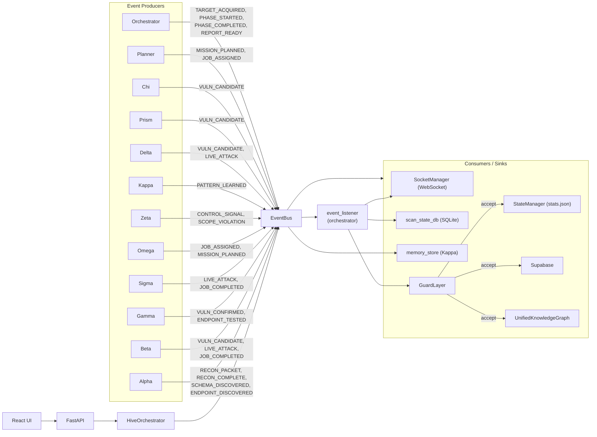

# Vigilagent — Data Flow

> One‑page diagram + per‑event narrative. The closed event vocabulary is
> declared in `backend/core/hive.py:18-37` (`EventType`). Every event carries a
> `scan_id` and routes through that scan's `ScanContext` queue
> (`backend/core/hive.py:172-201`).

---

## 1. The one‑page diagram



**Reading the diagram.**

- Every agent publishes through one bus instance.
- The orchestrator subscribes a master `event_listener` to **every**
  `EventType` (`backend/core/orchestrator.py:413-415`) so it can fan out to
  the WebSocket, dashboards, durable DB, and supabase.
- The `GuardLayer` is the only consumer that can **drop** a `VULN_CONFIRMED`
  event, and it does so based on the ≥2‑signal evidence rule (§17).

---

## 2. The HiveEvent envelope

Every event is a Pydantic model:

```text
HiveEvent
├─ id          : str  (uuid4)
├─ scan_id     : str  (default "GLOBAL")
├─ timestamp   : datetime (utcnow)
├─ type        : EventType
├─ source      : str  (agent name, e.g. "agent_alpha")
└─ payload     : dict[str, Any]
```

Source: `backend/core/hive.py:39-47`.

**Routing rule.**

- `scan_id == "GLOBAL"` → executed inline against all subscribers, *not*
  routed through any per‑scan queue. Used for system‑wide events
  (`backend/core/hive.py:165-172`).
- Everything else → enqueued on `ScanContext.event_queue` and consumed
  serially per scan (causal ordering inside a scan).

**Sanitisation pipeline.** `EventBus.publish` runs every payload through
`_sanitize_event_payload` (`hive.py:103-135`) and `watch_output` before
delivery; if the GuardLayer raises `PromptInjectionBlocked`, the event is
rewritten to a benign `LOG` event so downstream consumers still see the
trail.

---

## 3. The 22 event types

Below: producers, payload shape (best inferred from code), and the
consumers that act on each event.

### 3.1 `SYSTEM_START`

- **Producer.** Lifespan / orchestrator boot.
- **Payload.** `{ state: str, mode: str }`.
- **Consumers.** UI banner. No DB write.
- **Notes.** Currently emitted as `LIFECYCLE_EVENT` over the WebSocket from
  `lifespan` (`backend/main.py:130-133`); the `EventType.SYSTEM_START`
  enum value is reserved for in‑bus emission.

### 3.2 `LOG`

- **Producer.** Any agent / `EventBus._safe_execute` reroute.
- **Payload.** `{ message: str, ... }`.
- **Consumers.** WS `LIVE_THREAT_LOG`, durable `events` table.
- **Notes.** `EventBus.publish` rewrites unsafe payloads into a `LOG` event
  with a `reason` field (`hive.py:142-150`).

### 3.3 `TARGET_ACQUIRED`

- **Producer.** Orchestrator (`orchestrator.py:756-764`).
- **Payload.** `{ url: str, tech_stack: list[str], scan_mode: str }`.
- **Consumers.** Alpha (recon kickoff), Omega (strategy selection).
- **Notes.** Marks the start of the recon phase.

### 3.4 `RECON_PACKET`

- **Producer.** Alpha + recon spine (`backend/agents/alpha_recon/*`).
- **Payload.** `{ url, severity, risk_score, source, ... }`.
- **Consumers.** WS broadcast (`orchestrator.py:399-410`),
  `unified_knowledge_graph.ingest_http_record`
  (`hive.py:158-162`), Kappa memory.
- **Notes.** Flood path; arrives in dozens per second during the HTTP/Browser
  phase. Kept off the slow path by the bulk insert helpers in
  `scan_state_db.add_events_bulk`.

### 3.5 `RECON_COMPLETE`

- **Producer.** Alpha (`source="agent_alpha"`).
- **Payload.** Recon stats (counts, phases run).
- **Consumers.** Orchestrator listener flips `alpha_recon_complete` event
  (`orchestrator.py:283-285`).
- **Notes.** Critical synchronisation point — waited on with timeout
  `RECON_MAX_WAIT_SECONDS = 180`.

### 3.6 `VULN_CANDIDATE`

- **Producer.** Sigma, Beta, Delta, Prism, Chi (anyone who finds an anomaly
  pre‑forensic).
- **Payload.** `{ url, tag, type, payload, evidence, confidence }`.
- **Consumers.** Gamma (forensic verification), WS broadcast
  (`orchestrator.py:386-399`).
- **Notes.** Soft signal. Promoted to `VULN_CONFIRMED` only after Gamma
  confirms.

### 3.7 `VULN_CONFIRMED`

- **Producer.** Gamma (and certain validated paths).
- **Payload.** `{ url, type, severity, data, payload, source, evidence }`.
- **Consumers (in order).**
  1. `GuardLayer.filter_single` — ≥2‑signal rule
     (`orchestrator.py:309`).
  2. `db_manager.report_vulnerability` — Supabase upsert
     (`database.py:55-99`).
  3. `stats_db_manager.record_finding` — UI counters.
  4. `CVSSCalculator` — base score + Bayesian fusion
     (`orchestrator.py:340-378`).
  5. `WS LIVE_THREAT_LOG` + `VULN_UPDATE`.
  6. `unified_knowledge_graph.ingest_finding` (`hive.py:163-164`).
- **Notes.** Single most expensive event in the system.

### 3.8 `AGENT_STATUS`

- **Producer.** `BaseAgent.start` / `stop`.
- **Payload.** `{ status: "ONLINE" | "OFFLINE" }`.
- **Consumers.** UI feed, agent health monitor.
- **Notes.** Health monitor distinguishes "idle" vs "unresponsive" via
  separate heartbeats — see `BaseAgent._health_reporting_loop`
  (`hive.py:530-575`).

### 3.9 `JOB_ASSIGNED`

- **Producer.** Orchestrator (when dispatching a `JobPacket`), Planner.
- **Payload.** `{ target: TaskTarget, config: ModuleConfig, source }`.
- **Consumers.** Worker substrate, the targeted agent class, WS feed.
- **Notes.** When `DistributedEventBus` is active, also pushed to Redis
  `pending_tasks` and `xytherion_audit_queue` (`hive.py:332-348`).

### 3.10 `JOB_COMPLETED`

- **Producer.** Any agent finishing a `JobPacket`.
- **Payload.** `{ job_id, status, duration_ms, result }`.
- **Consumers.** Orchestrator listener; also writes to
  `memory_store.remember_notification` (`hive.py:152-153`).

### 3.11 `CONTROL_SIGNAL`

- **Producer.** Zeta (governance), Operator API
  (`POST /api/scans/{id}/{pause|resume|cancel}` →
  `_signal` in `scans.py:131-152`).
- **Payload.** `{ signal: "THROTTLE" | "STEALTH_MODE" | "RESUME" | "ABORT" }`.
- **Consumers.** Every agent via `ControlSignalMixin.handle_control_signal`
  (`agent_mixins.py:142-178`).
- **Notes.** `THROTTLE` and `STEALTH_MODE` set `_throttled = True`;
  `RESUME` clears it. `ABORT` is interpreted by the orchestrator only.

### 3.12 `LIVE_ATTACK`

- **Producer.** Beta, Sigma, Delta when injecting.
- **Payload.** `{ url, action, arsenal, payload, agent }`.
- **Consumers.** WS broadcast as `LIVE_ATTACK_FEED` with a derived severity
  (`orchestrator.py:380-398`); persisted into the events buffer.

### 3.13 `SCHEMA_DISCOVERED`

- **Producer.** Alpha API recon (kiterunner / inql).
- **Payload.** `{ url, schema, format }`.
- **Consumers.** Memory store episode
  (`hive.py:154-157`), Sigma (payload generation).

### 3.14 `MOBILE_ENDPOINT_DISCOVERED`

- **Producer.** Alpha mobile recon path.
- **Payload.** `{ url, app_id, scheme }`.
- **Consumers.** Memory store, Sigma.

### 3.15 `SCOPE_VIOLATION`

- **Producer.** `ScopePolicy.assert_allowed` (every HTTP path), Zeta.
- **Payload.** `{ url, action, reason }`.
- **Consumers.** WS warning banner; durable scope log.
- **Notes.** Active actions outside an authorised window raise
  `ScopeViolation` *before* the event fires, so this event mostly captures
  near‑misses (request was in policy, but flagged).

### 3.16 `REPORT_READY`

- **Producer.** Orchestrator after the PDF builder finishes.
- **Payload.** `{ id: scan_id }`.
- **Consumers.** WS frame; UI fetches `/api/scans/{id}/report`.
- **Notes.** Test mode also emits this immediately
  (`orchestrator.py:198-201`).

### 3.17 `PATTERN_LEARNED`

- **Producer.** Kappa.
- **Payload.** `{ pattern: { vuln_type, confidence } }`.
- **Consumers.** Omega — boosts strategy aggression
  (`backend/agents/omega.py:46-58`).

### 3.18 `MISSION_PLANNED`

- **Producer.** MissionPlanner.
- **Payload.** `{ tasks: list[TaskNode] }`.
- **Consumers.** Orchestrator (debug), UI for task DAG visualisation.

### 3.19 `PHASE_STARTED` and 3.20 `PHASE_COMPLETED`

- **Producer.** Orchestrator + PhaseGate.
- **Payload.** `{ phase: "PLANNING|RECONNAISSANCE|ASSESSMENT|EXPLOITATION", timestamp, ... }`.
- **Consumers.** WS feed (UI phase indicator); checkpointer.
- **Notes.** `PHASE_COMPLETED` for `RECONNAISSANCE` carries
  `endpoints_discovered` (`orchestrator.py:847-855`).

### 3.21 `ENDPOINT_DISCOVERED` and 3.22 `ENDPOINT_TESTED`

- **Producer.** Recon (`DISCOVERED`), exploit agents (`TESTED`).
- **Payload.** `{ url, source | agent }`.
- **Consumers.** `EndpointTracker`
  (`orchestrator.py:425-453`); WS `COVERAGE_UPDATE` after every change.

### 3.23 `COVERAGE_UPDATE`

- **Producer.** Orchestrator after `EndpointTracker` updates.
- **Payload.** Tracker metrics (`{ discovered, tested, vulnerable, …}`).
- **Consumers.** UI coverage gauge.

---

## 4. WebSocket frame vocabulary (UI side)

The events delivered on `/stream` and `/ws/live` are **not** the same as
`HiveEvent` — they are UI‑shaped messages emitted by `SocketManager`. The
authoritative list:

| Frame `type` | Trigger | Source |
| --- | --- | --- |
| `LIFECYCLE_EVENT` | Lifespan start | `backend/main.py:130-133` |
| `SCAN_UPDATE` | Status changes | orchestrator + scan API |
| `LIVE_ATTACK_FEED` | LIVE_ATTACK / phase transitions / agent online / dashboard `publish_request_event` | orchestrator + recon endpoint |
| `LIVE_THREAT_LOG` | VULN_CONFIRMED, RECON candidates | orchestrator |
| `VULN_UPDATE` | Counter ticks | orchestrator |
| `JOB_ASSIGNED` | JOB_ASSIGNED hive event | orchestrator |
| `RECON_PACKET` | RECON_PACKET hive event | orchestrator |
| `PHASE_STARTED`, `PHASE_COMPLETED` | Phase boundary | orchestrator |
| `COVERAGE_UPDATE` | Endpoint tracker change | orchestrator |
| `REPORT_READY` | PDF completion | orchestrator |
| `SPY_STATUS` | Extension connect/disconnect | socket_manager |
| `GI5_LOG` | Generic info banner (e.g. self‑healing) | orchestrator |
| `BATCH` | Wraps multiple frames in one tick | socket_manager batcher |

A late‑joining UI receives a replay of the last 50 frames (excluding
`SPY_STATUS`). The batcher delivers a single `BATCH` envelope per 20 ms tick
when more than one event is queued (`socket_manager.py:193-203`).

---

## 5. Persistence side‑effects per event

| EventType | SQLite | Supabase | Redis | KG | Memory store |
| --- | --- | --- | --- | --- | --- |
| TARGET_ACQUIRED | ✓ events |   |   |   |   |
| RECON_PACKET | ✓ events |   |   | `ingest_http_record` | `remember_episode` |
| RECON_COMPLETE | ✓ events |   |   |   | `remember_episode` |
| VULN_CANDIDATE | ✓ events |   |   |   |   |
| VULN_CONFIRMED | ✓ events, findings | `vulnerabilities` upsert | `vuln:<sig>` 1h cache | `ingest_finding` |   |
| LIVE_ATTACK | ✓ events |   |   |   |   |
| JOB_ASSIGNED | ✓ events |   | `pending_tasks` + `audit_queue` (distributed only) |   |   |
| JOB_COMPLETED | ✓ events |   |   |   | `remember_notification` |
| SCHEMA_DISCOVERED | ✓ events |   |   |   | `remember_episode` |
| ENDPOINT_DISCOVERED | ✓ events |   |   |   |   |
| ENDPOINT_TESTED | ✓ events |   |   |   |   |
| PHASE_STARTED / PHASE_COMPLETED | ✓ events + checkpoints |   |   |   |   |
| REPORT_READY | ✓ events |   |   |   |   |

(`✓ events` = persisted via `stats_db_manager.add_scan_event` and/or
`scan_state_db.add_event`. The exact path differs by orchestrator branch.)

---

## 6. Ordering guarantees

Within a scan:

- **FIFO by publish time.** Each `ScanContext` has a single asyncio task
  draining its queue, so subscribers run in publish order
  (`hive.py:79-95`).
- **Exact‑once subscriber dispatch.** `EventBus.publish` checks
  `event.id in ctx._recent_events` before enqueueing
  (`hive.py:175-188`).

Across scans:

- **No cross‑scan ordering.** Each scan owns its queue. The orchestrator's
  master listener is a global subscriber that runs concurrently with other
  scans' listeners.

WebSocket fan‑out:

- **Best‑effort fairness.** All UI sockets get the same JSON string in the
  same `asyncio.gather(...)` (`socket_manager.py:194-198`). Slow clients
  see a 1 s timeout and are dropped.
