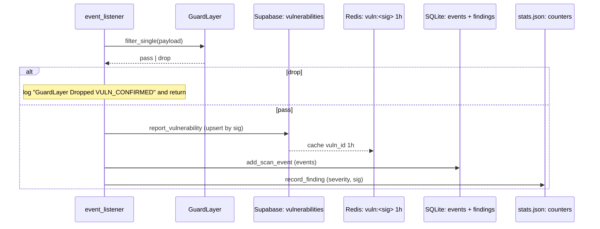

# Vigilagent — Database Schema

> Two persistence tiers:
> 1. **SQLite + WAL + FTS5** — durable execution state for one node.
>    Declared in `backend/core/scan_state_db.py`. The `_SCHEMA` SQL is the
>    single source of truth (`scan_state_db.py:35-200`).
> 2. **Supabase** — distributed intelligence shared across cluster
>    members. There is **no SQL migration in this repo** for the Supabase
>    side; column lists are inferred from the upserts in
>    `backend/core/database.py`. Each inferred column is flagged as such.

---

## 1. SQLite — `scan_states/scan_state.db`

`backend/core/scan_state_db.py`. Schema version is `_SCHEMA_VERSION = 2`
(`:36`); migrations run on every connect (`_migrate` at `:255-272`).

PRAGMAs applied at connect time (`scan_state_db.py:236-243`):

- `journal_mode = WAL` (with `DELETE` fallback if WAL fails).
- `synchronous = NORMAL`.
- `foreign_keys = ON`.

### 1.1 `schema_version`

Single‑row table tracking the migration version.

| Column | Type | Notes |
| --- | --- | --- |
| `version` | INTEGER | NOT NULL. Single row. |

### 1.2 `scans`

Master scan record.

| Column | Type | Notes |
| --- | --- | --- |
| `scan_id` | TEXT | PRIMARY KEY. |
| `parent_scan_id` | TEXT | Parent scan (after compression / resume). |
| `target` | TEXT | URL. |
| `mode` | TEXT | STANDARD / AGGRESSIVE / PASSIVE_ONLY. |
| `phase` | TEXT | Current `ScanPhase`. |
| `status` | TEXT | Initializing / Running / Paused / Completed / Failed / Cancelled. |
| `authorized` | INTEGER | 1 if engagement is explicitly authorized (§9). |
| `created_at` | TEXT | ISO‑8601 UTC. |
| `updated_at` | TEXT | ISO‑8601 UTC. |
| `meta` | TEXT | JSON blob. |

**Retention.** Permanent; cleaned up only by operator action.

### 1.3 `scan_sessions`

Session chains for resumed scans.

| Column | Type | Notes |
| --- | --- | --- |
| `session_id` | TEXT | PRIMARY KEY. |
| `scan_id` | TEXT | Parent scan. |
| `parent_session_id` | TEXT | Previous session in the chain. |
| `created_at` | TEXT | ISO‑8601 UTC. |
| `summary` | TEXT | Free‑form session description. |

### 1.4 `tasks`

Durable task queue with leases.

| Column | Type | Notes |
| --- | --- | --- |
| `task_id` | TEXT | PRIMARY KEY. |
| `scan_id` | TEXT | FK → `scans`. |
| `parent_task_id` | TEXT | Parent in the DAG. |
| `agent` | TEXT | Owning agent name. |
| `objective` | TEXT | Human‑readable goal. |
| `phase` | TEXT | `MissionState`. |
| `status` | TEXT | pending / running / completed / cancelled. |
| `lease_owner` | TEXT | Worker that holds the lease. |
| `lease_expires_at` | REAL | Unix epoch seconds. |
| `created_at` | TEXT | ISO‑8601 UTC. |
| `updated_at` | TEXT | ISO‑8601 UTC. |
| `payload` | TEXT | JSON blob (params, target). |

**Lease semantics** — `acquire_lease` (`scan_state_db.py:325-336`) refuses
to take over an unexpired lease held by another owner. Default TTL is
300 seconds; the lease must be renewed or released.

### 1.5 `task_attempts`

Retry log per task.

| Column | Type | Notes |
| --- | --- | --- |
| `attempt_id` | INTEGER | PRIMARY KEY AUTOINCREMENT. |
| `task_id` | TEXT |  |
| `attempt_no` | INTEGER |  |
| `status` | TEXT |  |
| `started_at` | TEXT |  |
| `finished_at` | TEXT |  |
| `error` | TEXT | Truncated traceback or message. |

### 1.6 `agent_runs`

| Column | Type | Notes |
| --- | --- | --- |
| `run_id` | TEXT | PRIMARY KEY. |
| `scan_id` | TEXT |  |
| `agent` | TEXT |  |
| `phase` | TEXT |  |
| `status` | TEXT |  |
| `budget_used` | INTEGER | Iterations consumed. |
| `started_at` | TEXT |  |
| `finished_at` | TEXT |  |
| `summary` | TEXT |  |

### 1.7 `tool_runs`

Audit trail for every TerminalEngine invocation.

| Column | Type | Notes |
| --- | --- | --- |
| `tool_run_id` | TEXT | PRIMARY KEY. |
| `scan_id` | TEXT |  |
| `tool` | TEXT | Tool name from `RECON_TOOLS`. |
| `agent` | TEXT |  |
| `backend` | TEXT | `local` or `docker`. |
| `exit_code` | INTEGER |  |
| `status` | TEXT | success / timeout / cancelled / failed. |
| `duration_ms` | INTEGER |  |
| `output_sha256` | TEXT | Integrity hash. |
| `output_summary` | TEXT | Truncated text. |
| `created_at` | TEXT |  |

**FTS index.** Each row is also indexed in `search_index` with
`kind="tool_run"`.

### 1.8 `messages`

Chat‑like conversation transcript.

| Column | Type | Notes |
| --- | --- | --- |
| `msg_id` | INTEGER | PRIMARY KEY AUTOINCREMENT. |
| `scan_id` | TEXT |  |
| `role` | TEXT | system / user / agent. |
| `agent` | TEXT |  |
| `content` | TEXT |  |
| `created_at` | TEXT |  |

**FTS index.** `kind="message"`.

### 1.9 `events`

Per‑scan event stream (HiveEvent persistence).

| Column | Type | Notes |
| --- | --- | --- |
| `event_id` | INTEGER | PRIMARY KEY AUTOINCREMENT. |
| `scan_id` | TEXT |  |
| `type` | TEXT | `EventType` enum value. |
| `source` | TEXT | Producer agent. |
| `payload` | TEXT | JSON blob. |
| `created_at` | TEXT |  |

**Bulk insert helper.** `add_events_bulk`
(`scan_state_db.py:354-372`) batches in one transaction. Used in tight
loops by the recon spine.

### 1.10 `approvals`

Human‑in‑the‑loop gate.

| Column | Type | Notes |
| --- | --- | --- |
| `approval_id` | TEXT | PRIMARY KEY. |
| `scan_id` | TEXT |  |
| `action` | TEXT |  |
| `status` | TEXT | pending / approved / denied. |
| `requested_at` | TEXT |  |
| `decided_at` | TEXT |  |
| `decided_by` | TEXT |  |
| `detail` | TEXT |  |

### 1.11 `findings`

Confirmed findings (deduplicated; see also `_findings_from_scan` in the
scans API).

| Column | Type | Notes |
| --- | --- | --- |
| `finding_id` | TEXT | PRIMARY KEY. |
| `scan_id` | TEXT |  |
| `title` | TEXT |  |
| `severity` | TEXT | INFO / LOW / MEDIUM / HIGH / CRITICAL. |
| `state` | TEXT | candidate / confirmed / promoted. |
| `confidence` | REAL | 0.0 — 1.0. |
| `asset` | TEXT | URL or asset id. |
| `description` | TEXT |  |
| `evidence_ids` | TEXT | JSON list of evidence ids. |
| `created_at` | TEXT |  |

**FTS index.** `kind="finding"`.

### 1.12 `evidence`

Supporting artifacts.

| Column | Type | Notes |
| --- | --- | --- |
| `evidence_id` | TEXT | PRIMARY KEY. |
| `scan_id` | TEXT |  |
| `finding_id` | TEXT | FK to `findings`. |
| `kind` | TEXT | request / response / screenshot / dom / file. |
| `path` | TEXT | File path (relative). |
| `sha256` | TEXT |  |
| `description` | TEXT |  |
| `created_at` | TEXT |  |

**FTS index.** `kind="evidence"`.

### 1.13 `skills`

Skill catalogue (Architecture §5.3).

| Column | Type | Notes |
| --- | --- | --- |
| `skill_id` | TEXT | PRIMARY KEY. |
| `name` | TEXT |  |
| `domain` | TEXT |  |
| `risk_class` | TEXT |  |
| `promotion_state` | TEXT | candidate / accepted / blocked. |
| `success_rate` | REAL |  |
| `failure_rate` | REAL |  |
| `meta` | TEXT | JSON blob. |
| `updated_at` | TEXT |  |

### 1.14 `skill_runs`

Per‑skill invocation log.

| Column | Type | Notes |
| --- | --- | --- |
| `skill_run_id` | TEXT | PRIMARY KEY. |
| `scan_id` | TEXT |  |
| `skill_id` | TEXT |  |
| `agent` | TEXT |  |
| `risk_class` | TEXT |  |
| `scope_decision` | TEXT |  |
| `confidence` | REAL |  |
| `result` | TEXT |  |
| `created_at` | TEXT |  |

### 1.15 `learning_updates`

Auditable agent‑evolution log.

| Column | Type | Notes |
| --- | --- | --- |
| `update_id` | TEXT | PRIMARY KEY. |
| `scan_id` | TEXT |  |
| `kind` | TEXT |  |
| `subsystem` | TEXT |  |
| `detail` | TEXT | JSON blob. |
| `created_at` | TEXT |  |

### 1.16 `graph_nodes` and `graph_edges`

Per‑scan target graph.

`graph_nodes`:

| Column | Type | Notes |
| --- | --- | --- |
| `node_id` | TEXT | PRIMARY KEY. |
| `scan_id` | TEXT |  |
| `kind` | TEXT |  |
| `label` | TEXT |  |
| `props` | TEXT | JSON blob. |

`graph_edges`:

| Column | Type | Notes |
| --- | --- | --- |
| `edge_id` | TEXT | PRIMARY KEY. |
| `scan_id` | TEXT |  |
| `src_id` | TEXT |  |
| `dst_id` | TEXT |  |
| `kind` | TEXT |  |
| `weight` | REAL |  |

These are snapshot‑captured into checkpoints via
`_capture_graph_snapshot` (`scan_state_db.py:454-463`).

### 1.17 `checkpoints`

Phase‑boundary safe checkpoints (Architecture §20).

| Column | Type | Notes |
| --- | --- | --- |
| `checkpoint_id` | TEXT | PRIMARY KEY. |
| `scan_id` | TEXT |  |
| `phase` | TEXT |  |
| `completed_endpoints` | TEXT | JSON list. |
| `pending_endpoints` | TEXT | JSON list. |
| `findings` | TEXT | JSON list. |
| `graph_snapshot` | TEXT | JSON blob. |
| `budgets` | TEXT | JSON blob. |
| `boundary` | TEXT | `phase_complete` / `pre_validation`. (Added in v2.) |
| `safe` | INTEGER | 1 if this is a safe resume target. (v2.) |
| `agent_health` | TEXT | JSON blob. (v2.) |
| `remaining_tasks` | TEXT | JSON list of pending tasks. (v2.) |
| `created_at` | TEXT |  |

`resume()` (`scan_state_db.py:499-540`) prefers the latest
`safe = 1` checkpoint; falls back to the most recent if none is flagged.

### 1.18 `search_index` (FTS5)

Virtual table for full‑text search across messages, tool runs, findings,
and evidence.

| Column | Notes |
| --- | --- |
| `scan_id` |  |
| `kind` | message / tool_run / finding / evidence. |
| `ref_id` | Source row id as TEXT. |
| `text` | Truncated to 8000 chars. |

**Source.** `_FTS_SCHEMA` at `scan_state_db.py:202-206`. Best‑effort:
`_init_schema` flips `_fts_enabled = False` if FTS5 isn't compiled in.

### 1.19 SQLite indexes

The schema does not declare extra indexes beyond primary keys and the FTS
virtual table; queries rely on the primary key + the WHERE clauses on
`scan_id`. Future tuning candidates if a query plan ever becomes slow
should be:

- `CREATE INDEX idx_events_scan_type ON events(scan_id, type);`
- `CREATE INDEX idx_findings_scan_state ON findings(scan_id, state);`
- `CREATE INDEX idx_tasks_scan_status ON tasks(scan_id, status);`

These are **not** in the current schema.

### 1.20 SQLite retention policy

- **No automatic deletion.** The DB grows monotonically until an operator
  reclaims it.
- **Resume** (`resume()`) does not delete anything; it re‑points the scan
  to the last safe checkpoint and re‑enqueues remaining tasks.
- **`reset_stale_scans`** runs in `lifespan` (`backend/main.py:48`) and
  *re‑labels* zombie scans from a previous ungraceful shutdown — it does
  not delete rows.

---

## 2. Supabase

> **Heads up.** There is no SQL declaration for these tables in this
> repository. The columns below are inferred from the dictionary literals
> passed to `self.supabase.table(...).insert/upsert(...)` in
> `backend/core/database.py`. **Every column flagged "(inferred)" is best
> effort.** The authoritative schema lives in the Supabase project itself.

The Supabase project is configured via `SUPABASE_URL` + `SUPABASE_KEY`
(`backend/core/config.py:88-89`). When neither is set, the
`EliteDBManager` short‑circuits every call (`database.py:40`).

### 2.1 `vulnerabilities` (inferred)

Source: `database.py:53-99` (`report_vulnerability`).

| Column | Type | Notes |
| --- | --- | --- |
| `id` | UUID | PK. |
| `scan_id` | TEXT |  |
| `endpoint` | TEXT | normalised lowercase URL. |
| `vuln_type` | TEXT | upper‑cased enum. |
| `severity` | TEXT | INFO / LOW / MEDIUM / HIGH / CRITICAL. |
| `evidence` | JSONB | full event payload. |
| `validated_by` | TEXT | confirming agent name. |
| `timestamp` | TIMESTAMPTZ |  |

**Constraints.** `report_vulnerability` calls
`upsert(data, on_conflict="scan_id,endpoint,vuln_type")`, which implies a
**unique index on `(scan_id, endpoint, vuln_type)`**.

**Retention.** Permanent in Supabase. Redis hot‑cache TTL is 1 hour
(`vuln:<sig>` key, `database.py:80-83`).

### 2.2 `distributed_tasks` (inferred)

Source: `database.py:104-138` (`acquire_task_lock`, `complete_task`,
`create_tasks_batch`).

| Column | Type | Notes |
| --- | --- | --- |
| `id` | UUID | PK. |
| `status` | TEXT | PENDING / RUNNING / COMPLETED / FAILED. |
| `locked_by` | TEXT | Worker id. |
| `lock_time` | TIMESTAMPTZ |  |
| `updated_at` | TIMESTAMPTZ |  |

**Notes.** Other columns (target, payload, priority) are passed through
`create_tasks_batch` but their schema is decided server‑side. The lock
flow checks `eq("status", "PENDING")` on update so the table is treated
as a simple state machine.

### 2.3 `exploit_results` (inferred)

Source: `database.py:160-178` (`log_exploit_result`).

| Column | Type | Notes |
| --- | --- | --- |
| `id` | UUID | PK. |
| `vuln_id` | UUID | FK → `vulnerabilities.id`. |
| `payload` | TEXT | Sanitised; default `"N/A"`. |
| `worker_id` | TEXT |  |
| `status` | TEXT | EXPLOITED / FAILED. |
| `response_dump` | TEXT | Body excerpt. |
| `execution_time_ms` | INTEGER |  |

### 2.4 `scan_episodes` (inferred)

Source: `database.py:201-216` (`store_scan_episode`).

| Column | Type | Notes |
| --- | --- | --- |
| `id` | UUID | PK. |
| `scan_id` | TEXT |  |
| `event_type` | TEXT |  |
| `payload` | JSONB |  |

**Notes.** Used as a long‑term episodic memory store (`memory_store`).

### 2.5 `semantic_memory` (inferred)

Source: `database.py:219-247` (`store_semantic_memory`).

| Column | Type | Notes |
| --- | --- | --- |
| `id` | UUID | PK. |
| `memory_type` | TEXT |  |
| `endpoint_pattern` | TEXT |  |
| `vuln_type` | TEXT |  |
| `content` | TEXT |  |
| `metadata` | JSONB |  |
| `embedding` | VECTOR | pgvector column when enabled. |
| `confidence` | REAL |  |

**Notes.** When `pgvector` is installed in Supabase, `embedding` is a
`vector` column; otherwise it falls back to JSON. The Python side passes
a `list[float]` either way.

### 2.6 `recon_runs` (inferred)

Source: `database.py:249-279` (`create_recon_run`, `finish_recon_run`).
Upsert key: `scan_id`.

| Column | Type | Notes |
| --- | --- | --- |
| `scan_id` | TEXT | PK (unique). |
| `target` | TEXT |  |
| `mode` | TEXT |  |
| `scope` | JSONB |  |
| `artifact_root` | TEXT |  |
| `status` | TEXT | running / completed. |
| `started_at` | TIMESTAMPTZ |  |
| `finished_at` | TIMESTAMPTZ |  |

### 2.7 `recon_entities` (inferred)

Source: `database.py:282-309` (`upsert_recon_entity`). Upsert key: `id`.

| Column | Type | Notes |
| --- | --- | --- |
| `id` | TEXT | PK. |
| `scan_id` | TEXT |  |
| `kind` | TEXT |  |
| `label` | TEXT |  |
| `normalized` | JSONB |  |
| `sources` | JSONB |  |
| `confidence` | REAL |  |
| `last_seen` | TIMESTAMPTZ |  |

### 2.8 `recon_artifacts` (inferred)

Source: `database.py:311-338` (`create_recon_artifact`). Upsert key: `id`.

| Column | Type | Notes |
| --- | --- | --- |
| `id` | TEXT | PK. |
| `scan_id` | TEXT |  |
| `tool_name` | TEXT |  |
| `artifact_type` | TEXT |  |
| `path` | TEXT | File path. |
| `sha256` | TEXT |  |
| `bytes` | INTEGER |  |
| `metadata` | JSONB |  |

### 2.9 `recon_endpoint_scores` (inferred)

Source: `database.py:340-359` (`upsert_endpoint_score`). Upsert key: `id`.

| Column | Type | Notes |
| --- | --- | --- |
| `id` | TEXT | PK. |
| `scan_id` | TEXT |  |
| `endpoint_id` | TEXT |  |
| `score` | INTEGER |  |
| `reasons` | JSONB | text array. |
| `omega_modules` | JSONB | text array. |

### 2.10 `toolcalls` (inferred)

Source: `database.py:362-409` (`create_toolcall`, `finish_toolcall`).

| Column | Type | Notes |
| --- | --- | --- |
| `id` | UUID | PK. |
| `call_id` | TEXT | Logical id; queried by `eq("call_id", …)` in `finish_toolcall`. |
| `scan_id` | TEXT |  |
| `tool_name` | TEXT |  |
| `agent` | TEXT |  |
| `args` | JSONB |  |
| `status` | TEXT | running / success / failed / cancelled. |
| `error` | TEXT |  |
| `started_at` | TIMESTAMPTZ |  |
| `finished_at` | TIMESTAMPTZ |  |
| `result` | JSONB |  |
| `duration_ms` | INTEGER |  |
| `result_bytes` | INTEGER |  |
| `result_sha256` | TEXT |  |

### 2.11 `approvals` (inferred)

Source: `database.py:412-431` (`create_approval`).

| Column | Type | Notes |
| --- | --- | --- |
| `id` | UUID | PK. |
| `approval_id` | TEXT | Logical id. |
| `scan_id` | TEXT |  |
| `tool_name` | TEXT |  |
| `reason` | TEXT |  |
| `payload` | JSONB |  |
| `status` | TEXT | pending / approved / denied. |
| `created_at` | TIMESTAMPTZ |  |

> **Naming overlap.** Both SQLite (§1.10) and Supabase have an
> `approvals` table. They serve the same purpose at different tiers; the
> SQLite version is per‑node, the Supabase version is shared.

### 2.12 `http_requests` and `http_responses` (inferred)

Source: `database.py:434-475` (`log_http_exchange`).

`http_requests`:

| Column | Type | Notes |
| --- | --- | --- |
| `id` | UUID | PK. |
| `request_id` | TEXT |  |
| `scan_id` | TEXT |  |
| `method` | TEXT |  |
| `url` | TEXT |  |
| `headers` | JSONB |  |
| `body` | JSONB or TEXT |  |
| `elapsed_ms` | INTEGER |  |

`http_responses`:

| Column | Type | Notes |
| --- | --- | --- |
| `id` | UUID | PK. |
| `request_db_id` | UUID | FK → `http_requests.id`. |
| `request_id` | TEXT | Logical id (mirror of request). |
| `scan_id` | TEXT |  |
| `status` | INTEGER | HTTP status code. |
| `headers` | JSONB |  |
| `body` | TEXT |  |
| `body_preview` | TEXT | First 4000 chars (`database.py:469`). |

### 2.13 Supabase indexes (inferred)

The code only references indexes implicitly:

- `vulnerabilities` — unique on `(scan_id, endpoint, vuln_type)` from the
  `on_conflict` clause.
- `recon_runs` — unique on `scan_id` (upsert key).
- `recon_entities`, `recon_artifacts`, `recon_endpoint_scores` — unique on
  `id` (upsert key).
- All other tables — primary key only as far as Python knows. The actual
  Supabase project may carry more.

### 2.14 Supabase retention

There is **no retention policy in the application code**. Cleanup is
operator‑managed in the Supabase dashboard. Notes:

- The Redis hot‑cache for `vulnerabilities` expires entries after 1 hour;
  the Supabase row stays.
- `distributed_tasks` is intended to be drained by workers; nothing
  garbage‑collects abandoned tasks automatically.
- `http_requests` / `http_responses` can grow quickly under load — flag
  for production deployments.

---

## 3. Cross‑tier write paths

This is the canonical path a confirmed finding takes through both
tiers, drawn from `backend/core/orchestrator.py:303-378`:

---

## 4. Schema migrations

### SQLite

`_migrate` (`scan_state_db.py:255-272`) is **additive only**. v1 → v2
added the four columns to `checkpoints` (`boundary`, `safe`,
`agent_health`, `remaining_tasks`). The ALTERs are wrapped in
`try/except OperationalError` so they're idempotent.

To add a new column going forward:

1. Add it to `_SCHEMA` so fresh installs get it.
2. Append an `ALTER TABLE` to the `_migrate` tuple.
3. Bump `_SCHEMA_VERSION`.

### Supabase

There is no migration tooling in this repo. `backend/db_migrate.py` exists
(`backend/db_migrate.py:1`) and references files like
`backend/core/schema.sql` and
`backend/agents/alpha_recon/schema_extensions.sql` — those are **the
intended schema source of truth** but their existence in the repo is not
guaranteed. Treat the Supabase schema as operator‑maintained.

---

## 5. Honest gaps

- **No SQL DDL for Supabase in this repo.** Every column above is inferred
  from upserts in `database.py`. If you need the canonical schema, query
  the Supabase project directly.
- **No declared SQLite indexes beyond PKs and FTS.** Suggested indexes are
  listed in §1.19 but **not** present in the running schema.
- **Schema versioning is single‑value.** There is no per‑table or
  per‑subsystem versioning. Adding a v3 means bumping `_SCHEMA_VERSION` and
  appending to `_migrate`.
- **Retention is operator‑driven.** The application never deletes scan
  data. For long‑running deployments, plan periodic vacuums of `events`,
  `messages`, `http_requests`, and `http_responses`.
