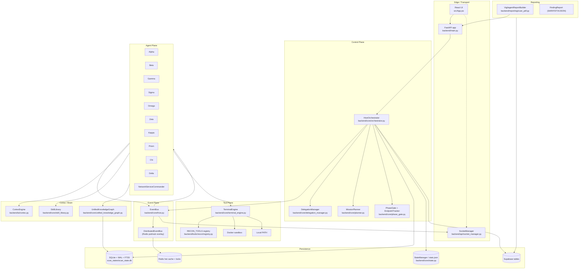
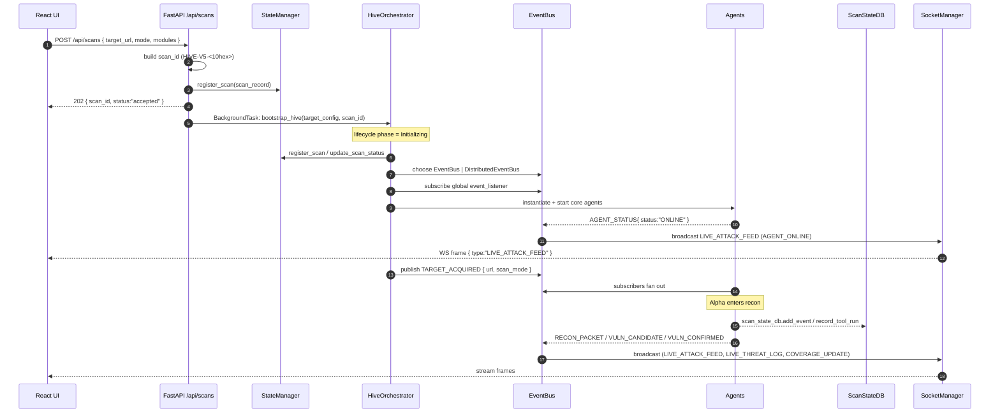
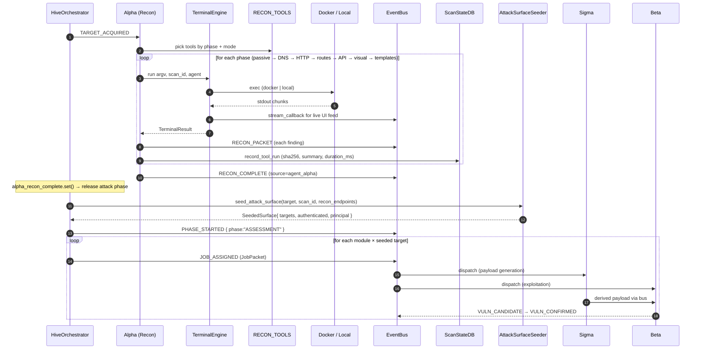
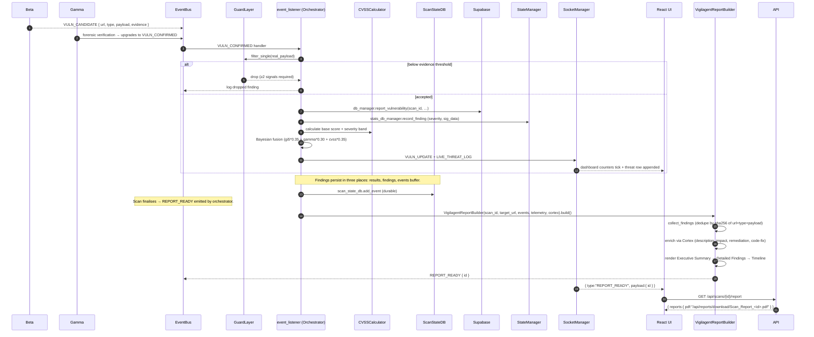
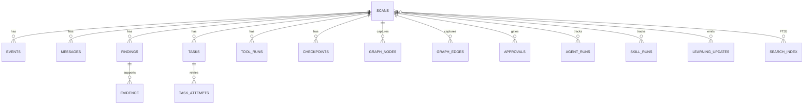

# Vigilagent — System Design

> Companion to `ARCHITECTURE.md`. This document zooms into the components,
> the data‑flow contracts between them, the API surfaces they expose, the DB
> tables that back them, and the caching strategy that keeps the hot path
> fast.

---

## 1. Component map

The control plane is intentionally thin: the Orchestrator doesn't *own* state,
it owns *lifecycle*. State lives in the persistence layer; reasoning lives in
agents; coordination is done by the EventBus and the DelegationManager.

---

## 2. Sequence — Create scan

**Notes.**

- The `202` response is the contract surface — the UI must poll
  `GET /api/scans/{id}` or rely on the WebSocket stream for progress.
- `BackgroundTasks` is the right tool here because `bootstrap_hive` is a
  long‑running coroutine that must outlive the request lifecycle.
- The Orchestrator never returns; instead it broadcasts `SCAN_UPDATE`
  events the UI uses to advance state.

Source citations:

- `backend/api/endpoints/scans.py:42` — `create_scan`.
- `backend/core/orchestrator.py:78` — `bootstrap_hive`.
- `backend/api/socket_manager.py:175` — `_process_batch_queue`.

---

## 3. Sequence — Recon → Attack handoff

**Why the timeout matters.**

`alpha_recon_complete` is an `asyncio.Event` that the recon completion handler
sets when Alpha emits `RECON_COMPLETE`. The orchestrator waits up to
`RECON_MAX_WAIT_SECONDS` (default 180) and then proceeds with whatever surface
recon produced (`backend/core/orchestrator.py:773-789`). This guarantees the
attack phase is never starved by a stalled recon stage.

**The seeder.**

`backend/core/attack_surface_seeder.seed_attack_surface` is the bridge
between recon discovery and exploitation: it picks param‑carrying URLs from
recon, optionally authenticates, and returns a `SeededSurface` whose
`targets` list is fed into every `JobPacket` (`orchestrator.py:828-840`). If
seeding fails, the attack pipeline still runs against the bare base URL.

---

## 4. Sequence — Exploit confirmation → PDF report

**Why three persistence layers.**

The `_findings_from_scan` helper at `backend/api/endpoints/scans.py:182` calls
out the rationale: confirmed findings appear in `scan["results"]`,
`scan["findings"]`, and the `scan["events"]` buffer at different points in the
lifecycle. The API merges all three and dedupes by `(url, type)` so the
frontend always sees every confirmed finding even mid‑scan.

**LLM is enrichment‑only.**

The PDF builder uses the LLM strictly for prose (description, impact,
remediation bullets, code‑fix). Real data — target, scan_id, CVSS,
HTTP request/response, timeline — comes from the events buffer
(`backend/reporting/scan_pdf.py:303` design rules block).

---

## 5. API contract design

The full enumeration is in `API.md`. The high‑level shape:

| Surface | Prefix | Notes |
| --- | --- | --- |
| **Primary scan API** | `/api/scans` | Architecture §22; documented contract. |
| **Legacy attack/recon API** | `/api/attack`, `/api/recon` | Pre‑existing; kept additively. |
| **Reporting** | `/api/reports` | PDF, consolidated, diff, live, exports. |
| **Dashboard + auth + 2FA** | `/api/dashboard` | Session, CSRF, learning, evolution metrics. |
| **AI control plane** | `/api/ai`, `/api/runtime` | Mutations, tool runs, approvals, telemetry. |
| **Skills catalogue** | `/api/skills` | Browse + reload skill library. |
| **Defense / self-awareness** | `/api/defense`, `/api/self-awareness` | Threat analysis + agent introspection. |
| **Code & data tools** | `/api/analyze-code`, `/api/data` | Static analysis + per‑item RLS demo. |
| **Bridge for the Chrome extension** | `/bridge/*` | Capture session/token/traffic/dom/storage/ws. |
| **Alpha Recon v6** | `/api/v1/recon` | Direct REST controls for the new recon spine. |

Two design choices worth highlighting:

- **POST /api/attack/fire** explicitly maps Pydantic 422s to RFC‑7231 422
  responses (`backend/main.py:155-161`) — every other validation error returns
  HTTP 400 with a `detail` string, because the legacy frontend depends on the
  difference.
- **WebSocket auth** is config‑gated: `enabled: true` in `user_config.json`
  flips the `/stream` and `/ws/live` endpoints into "require token" mode
  (`backend/main.py:266-281`).

---

## 6. DB schema design

See `DB_SCHEMA.md` for the table‑by‑table reference. The shape:

**Two sources of truth.**

- **SQLite (`scan_state.db`)** — durable execution state. Survives restart;
  drives resume + checkpoints (`backend/core/scan_state_db.py:1`).
- **Supabase** — distributed intelligence. Survives across hosts; powers the
  cluster lock and the cross‑run knowledge layer
  (`backend/core/database.py:13`).

**Fallback.** When Supabase is not configured, `EliteDBManager` returns
`None`/`[]` from every helper; nothing crashes (`database.py:40-43`).

---

## 7. Caching strategy

Layered, with strict TTLs where data is observable in dashboards.

| Layer | What it caches | TTL | Why |
| --- | --- | --- | --- |
| Process‑local `_recent_events` set + FIFO | Event ids per scan | 1000 entries / unbounded time | Exact‑once dedupe inside `EventBus.publish` (`hive.py:175-188`). |
| Process‑local replay buffer | Last 50 broadcasts | drop after eviction | UX nicety for late‑joining UI WebSockets (`socket_manager.py:151`). |
| `_skill_rec_cache` per agent | `(target_url, classes) → list` | scan lifetime | Avoids hitting `skill_library` once per finding — see `agent_mixins.SkillRecallMixin` (`agent_mixins.py:43-100`). |
| `dashboard.py _stats_cache` | `/api/dashboard/stats` payload | 1‑2 s | Throttles polling; primary refresh is via WebSocket. |
| Redis "hot cache" | `vuln:<scan>:<endpoint>:<type>` signature | 1 hour | Suppresses redundant Supabase upserts (`database.py:71-83`). |
| Redis distributed locks | `lock:task:<task_id>`, `job_lock:<task_id>` | 10 min / 1 hour | Prevents duplicate work on cluster. |
| SocketManager batching | Outbound WS frames | 20 ms | Coalesces high‑RPS bursts into one frame. |

Two anti‑caching invariants:

1. **`should_emit` is permanently true.** The user wants every request shown
   live; no sampling at the WS layer (`socket_manager.py:24`).
2. **No per‑finding cache invalidation.** Findings are always re‑computed
   from the events buffer via `_findings_from_scan` so a mid‑scan reload
   never lies (`scans.py:182`).

---

## 8. Failure modes and recovery

| Failure | Detection | Recovery |
| --- | --- | --- |
| Subscriber raises | `_safe_execute` catches and logs (`hive.py:212`) | DLQ entry persisted; flushed via diagnostics. |
| Redis offline at boot | `DistributedEventBus.start` warning (`hive.py:283-291`) | Bus stays local; same code path as `serve` w/o Redis. |
| Redis offline mid‑run | publish exception caught (`hive.py:317-320`) | Local broadcast still happens; global sync skipped. |
| Supabase offline | All helpers short‑circuit on `if not self.supabase` | Returns `None`/`[]`; UI sees fewer cross‑run signals. |
| SQLite locked | `_write` retries with jitter (`scan_state_db.py:280-292`) | Up to 5 attempts; final raise propagates. |
| Recon stalls | `RECON_MAX_WAIT_SECONDS` upper bound (`orchestrator.py:777-789`) | Attack phase proceeds with degraded surface. |
| Tool not installed | `check_tool_availability` (`registry.py:74-100`) | `installed:false` returned to `/api/tools`; orchestrator skips. |
| Agent crashes | `recovery_engine.healing_engine.monitor_and_heal()` (`orchestrator.py:660-677`) | `restart_callback` re‑starts the agent and broadcasts `GI5_LOG`. |
| WebSocket peer dead | `_send_with_timeout` returns the connection on 1 s timeout (`socket_manager.py:166-173`) | Removed from `ui_connections` immediately. |

---

## 9. Concurrency primitives — at a glance

- **`asyncio.Queue`** — per `ScanContext` event queue. Backpressure is
  natural; subscribers run in series within a scan.
- **`asyncio.to_thread`** — every Supabase / blocking‑I/O call.
- **`asyncio.create_task`** — wrapped through `TaskManager` so shutdown
  cancels them cleanly (`backend/core/task_manager.py`).
- **`asyncio.Event`** — `alpha_recon_complete`
  (`orchestrator.py:271`); `is_cancelled` flag on `ScanContext`.
- **`asyncio.gather`** — used in `SocketManager._process_batch_queue` to send
  to all UI connections concurrently with `return_exceptions=True`.
- **`threading.RLock`** — protects SQLite writes inside `ScanStateDB._lock`
  (`scan_state_db.py:213`). Single‑process; no cross‑host contention.

---

## 10. Hot paths to watch

These sections are the ones a perf regression will show up in first:

1. **`EventBus.publish`** — runs the `_sanitize_event_payload` walker for
   every event. If you add new payload types, profile this first.
2. **`ScanStateDB.add_events_bulk`** — called in tight loops by the recon
   spine. Don't replace `executemany` with per‑row inserts.
3. **`SocketManager._process_batch_queue`** — 50 FPS WebSocket fan‑out. JSON
   serialisation happens once per tick; don't re‑serialise per connection.
4. **`VigilagentReportBuilder._enrich_findings`** — LLM calls per finding,
   bounded by `LLM_OVERALL_TIMEOUT = 600 s`. Adjust per‑call timeout if
   you add expensive prompts.
5. **`db_manager.report_vulnerability`** — Redis hot‑cache check before
   Supabase upsert; preserve that order.
