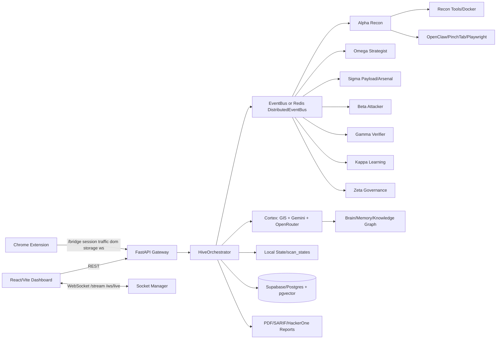
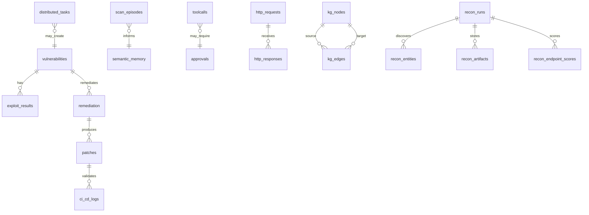
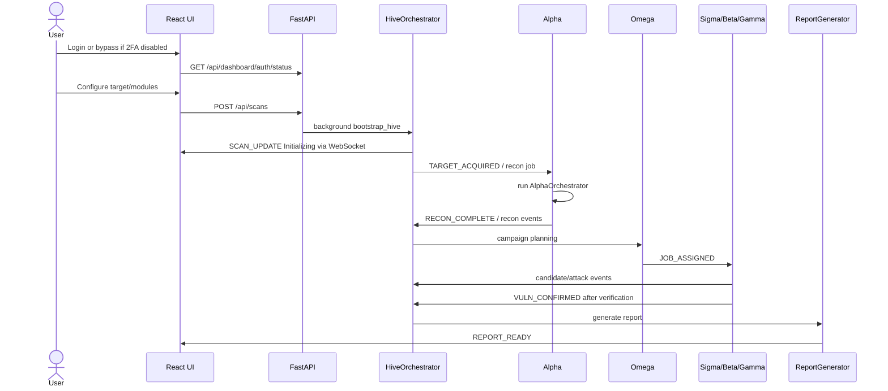
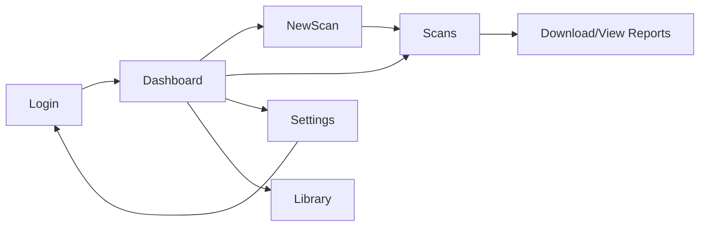
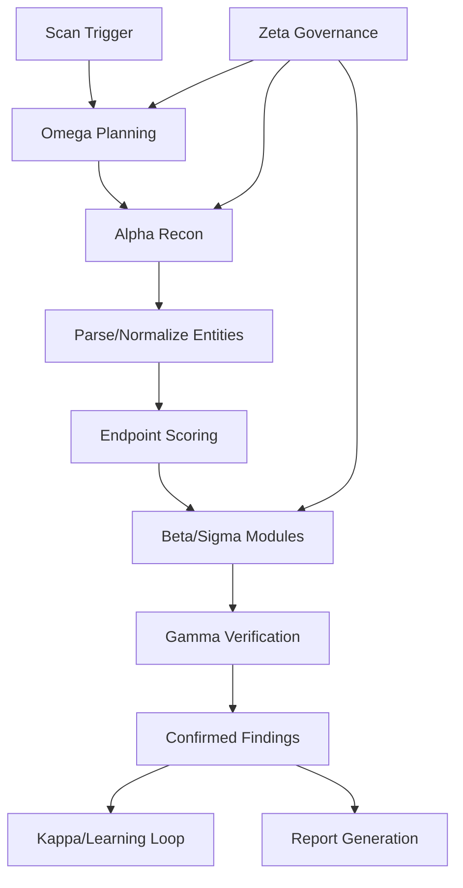
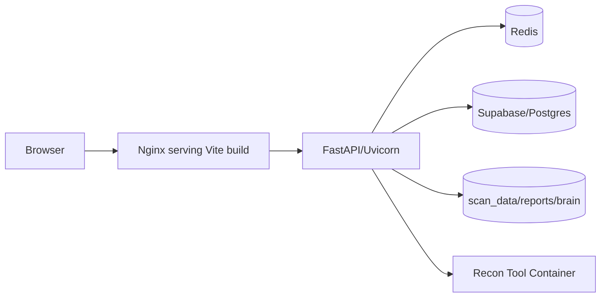
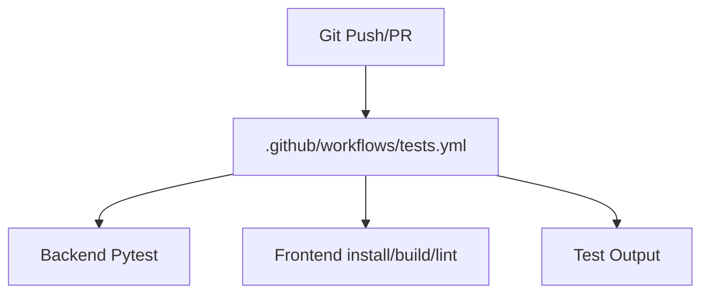
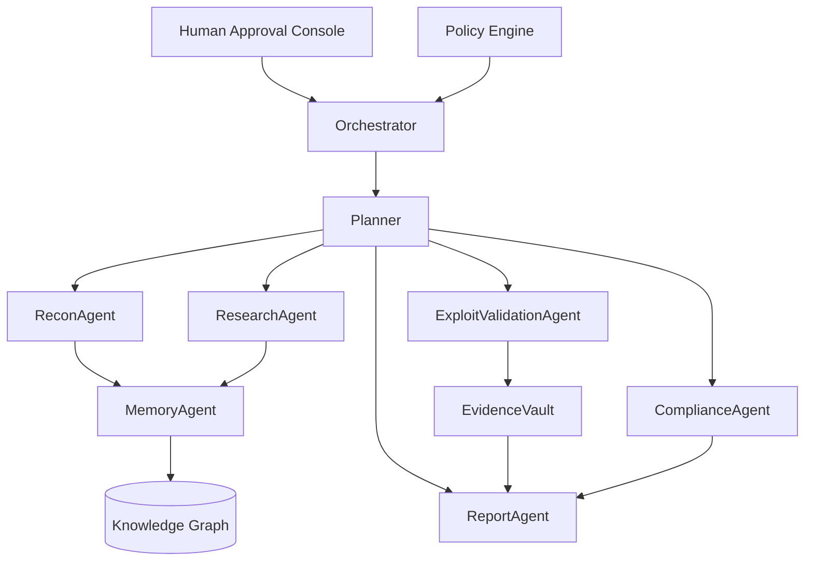

# VigilAgent Enterprise Reverse Engineering PRD

Generated: 2026-06-03  
Workspace: `D:\Antigravity 2\penetration testing system`  
Primary code references: `backend/main.py`, `backend/core/orchestrator.py`, `backend/core/schema.sql`, `backend/agents/*`, `backend/agents/alpha_recon/*`, `backend/ai/*`, `backend/api/endpoints/*`, `src/*`, `extension/*`, `config/*`  
Deep source/config/test inventory: `docs/vigilagent_file_inventory.generated.json`  
100% all-files coverage manifest: `docs/vigilagent_all_files_coverage.generated.json`

## 1. Executive Summary

VigilAgent is an AI-assisted autonomous security reconnaissance and vulnerability assessment platform. It combines a FastAPI backend, React/Vite dashboard, Chrome extension telemetry bridge, multi-agent scanning swarm, recon tool orchestration, browser-aware crawling, deterministic and LLM-assisted reasoning, persistent learning artifacts, report generation, and optional Redis/Supabase-backed distributed execution.

The product is positioned as an operator-driven AI security assessment system for authorized web/API testing. Its highest-value promise is reducing the manual effort required to move from target definition to recon, vulnerability probing, evidence collection, risk scoring, and executive/technical reporting.

The codebase is not a single polished SaaS platform yet. It is a powerful local/operator platform with many advanced subsystems implemented or partially scaffolded: scope policy, approval hooks, tool guardrails, knowledge graph, RAG-like recon memory, skill extraction, self-healing, browser orchestration, live monitoring, and report export. Enterprise readiness gaps remain around multi-tenancy, hardened authentication, secret management, policy enforcement consistency, deployment maturity, RBAC, audit logging, and test-data separation.

## 2. Repository Discovery

### 2.1 Folder Map

| Folder | Purpose | Inputs | Outputs | Relationships |
|---|---|---|---|---|
| `backend/` | FastAPI backend, agents, AI, recon, reports, runtime state. | API requests, WebSocket events, configs, env vars, tool output, browser extension events. | JSON APIs, WebSocket events, reports, findings, DB writes, scan artifacts. | Imports `config/*`; serves `src` consumers; writes `reports/`, `data/`, `brain/`; optional Redis/Supabase. |
| `backend/api/` | REST/WebSocket routing and socket fan-out. | HTTP requests, browser extension bridge events. | API responses, manager broadcasts. | Included by `backend/main.py`; invokes orchestrator/state/reporting. |
| `backend/agents/` | Agent implementations: Alpha, Beta, Gamma, Omega, Sigma, Zeta, Kappa, Delta, Prism, Chi, Lambda, commanders. | Hive events, job packets, scan context, graph/memory/skills. | New jobs, findings, verification results, control signals. | Built around `backend/core/hive.py`, `backend/core/protocol.py`, `backend/core/orchestrator.py`. |
| `backend/agents/alpha_recon/` | Unified Alpha V6 recon spine. | Target URL, scan mode/scope, recon tools, browser provider. | Entities, artifacts, endpoint scores, live recon events, exports. | Uses `backend/tools/recon`, parsers, browser orchestration, DB extensions. |
| `backend/ai/` | Hybrid intelligence layer. | Prompts, findings, payload/evidence data. | Strategies, payloads, narratives, validation, remediation, embeddings. | `CortexEngine` routes to GI5, Gemini, OpenRouter. |
| `backend/core/` | Runtime backbone: config, orchestration, state, DB, guardrails, memory, tools, telemetry, scope, queues, cluster, browser engines. | Env/config files, scan events, tool calls, HTTP records. | Events, persisted state, approvals, knowledge graph, telemetry. | Shared by all backend modules. |
| `backend/modules/` | Vulnerability modules. | Target endpoints, payloads, HTTP responses. | Candidate/confirmed vulnerabilities. | Invoked by agents and worker nodes. |
| `backend/parsers/recon/` | Parsers for recon tool outputs. | Raw outputs from amass, httpx, nuclei, ffuf, etc. | Normalized entities/findings/artifacts. | Used by Alpha recon ingestion pipeline. |
| `backend/reporting/` | PDF, SARIF, HackerOne, finding normalization, CVSS. | Scan events/findings/telemetry. | PDF and machine-readable exports. | Called by orchestrator and reports API. |
| `src/` | React SPA. | REST/WebSocket APIs, localStorage, user input. | Dashboard, scans, new scan flow, settings, library. | Talks to backend via `src/lib/api.js` and `src/hooks/useWebSocket.js`. |
| `extension/` | Chrome extension for browser capture/HUD/active defense. | Browser traffic, DOM, storage, user interactions. | `/bridge/*` events, HUD updates, local popup UI. | Connects backend bridge and WebSocket live monitor. |
| `config/` | Declarative scope, models, tools, skills, workers, budgets, engagement config. | Operator configuration. | Runtime policy and defaults. | Loaded by `backend/core/config.py`, scope/tool/model systems. |
| `scripts/` | Developer/operator automation. | CLI invocation and local service URLs. | Metrics, tokens, graphs, test generation, cleanup. | Useful for maintenance, not product runtime. |
| `tests/` | Pytest suites for core, unit, integration, e2e, property, chaos. | Backend modules and test fixtures. | Verification coverage. | Tests orchestrator, agents, browser, recon, reports, security controls. |
| `testsprite_tests/` | Generated TestSprite API/security/performance/integration tests and outputs. | Local backend. | Test reports, evidence. | Separate generated validation suite. |
| `docker/`, `Dockerfile*`, `docker-compose.yml`, `nginx.conf` | Containerization. | Source tree, env file. | Backend, frontend, Redis services. | Compose exposes backend `8000`, frontend `5173`, Redis `6379`. |
| `data/` | Runtime config and scan artifacts. | Scan output/tool artifacts. | Raw/normalized/exported recon artifacts. | Product data, not source logic. |
| `brain/` | Learning/memory/healing artifacts. | Completed scan episodes, learned patterns. | Local memory and healing state. | Consumed by learning and recommendation systems. |
| `reports/` | Generated reports and report README. | Scan findings/events. | PDF reports and named report folders. | Output directory, not source logic. |
| `.agents/` | Local skill library for the coding/agent environment. | Skill markdown. | Agent instructions. | Auxiliary workspace assets, not VigilAgent product runtime. |

### 2.2 File Inventory and Coverage Standard

The complete generated source/config/test inventory is in `docs/vigilagent_file_inventory.generated.json`. It contains deep analysis records with path, language, purpose, classes, functions, imports, exports, dependencies, and runtime usage notes for first-party product code, configuration, tests, extension assets, container assets, and operator scripts.

The full all-files manifest is in `docs/vigilagent_all_files_coverage.generated.json`. It accounts for every file currently visible in the workspace, including `.git`, `node_modules`, `.agents`, generated scan artifacts, caches, logs, local toolchains, reports, runtime state, archives, IDE metadata, and root documentation. This PRD uses two coverage levels:

- Deep semantic analysis for first-party source/config/test files that define product behavior.
- Category-level inventory and product impact analysis for vendor, generated, cache, runtime, archive, and local-environment files that do not define VigilAgent application behavior but are still part of the workspace.

No file category is intentionally left unaccounted. Sensitive files such as `.env`, `keyring.json`, vault/session material, and runtime credential stores are included by path/category only; their secret values are not copied into this document.

### 2.3 Key Dependencies

Backend dependencies are declared in `backend/requirements.txt` and root `requirements.txt`: FastAPI, Uvicorn, Pydantic, websockets, httpx/aiohttp/requests, Supabase, Redis, asyncpg, PyJWT, bcrypt/passlib, cryptography, OpenAI SDK, structlog/rich, Playwright, OpenClaw, pytest, fpdf2, psutil, pyotp, qrcode, pillow, networkx, scikit-learn, numpy.

Frontend dependencies in `package.json`: React 18, React DOM, Vite, framer-motion, Lenis, web-vitals, Tailwind/PostCSS/autoprefixer, ESLint.

Operational dependencies: Redis, optional Supabase/Postgres with pgvector, recon CLI tools, Docker recon image `vigilagent/recon:latest`, optional PinchTab/OpenClaw/browser automation.

## 3. Product Understanding

### 3.1 Product Vision

VigilAgent aims to be an AI-powered security assessment command center that automates authorized recon, attack surface discovery, vulnerability probing, verification, evidence packaging, learning, and reporting.

Primary problem: security testing is slow, fragmented across tools, and difficult to turn into reliable prioritized findings. VigilAgent centralizes this workflow into a live agentic pipeline.

Target users:

- Security analysts running authorized assessments.
- Bug bounty hunters needing rapid recon and structured reports.
- AppSec teams validating web/API attack surface.
- Red-team/pentest operators in controlled engagements.
- Security engineering leaders seeking dashboards and reports.

Security value proposition: shorten scan-to-finding-to-report time while preserving evidence, scope controls, validation signals, and live observability.

Market positioning: local-first AI security platform between conventional DAST/recon tooling and agentic research systems. It is more implementation-specific than AutoGPT/CrewAI/LangGraph, more security-focused than OpenHands, and more operator-driven than generic Deep Research.

### 3.2 Core Capabilities

| Capability | Implementation |
|---|---|
| Scan creation | `POST /api/scans` in `backend/api/endpoints/scans.py`; frontend `src/components/NewScan.jsx`; orchestrator `HiveOrchestrator.bootstrap_hive`. |
| Live dashboard | `src/components/Dashboard.jsx`, shared WebSocket hook, `backend/api/socket_manager.py`, `/stream` and `/ws/live`. |
| Reconnaissance | `AlphaAgent` delegates to `AlphaOrchestrator`; tools planned by `backend/tools/recon/commands.py`, guarded by `guardrails.py`, parsed under `backend/parsers/recon/`. |
| Browser-aware discovery | `backend/core/browser_orchestrator.py`, `openclaw_engine.py`, `pinchtab_engine.py`, `Alpha browser_recon.py`, extension bridge. |
| Vulnerability modules | Technical modules: SQLi, XSS, JWT, LFI, command injection, auth bypass, fuzzing. Logic modules: tycoon, escalator, skipper, doppelganger, chronomancer. |
| Agent orchestration | EventBus/DistributedEventBus, `HiveOrchestrator`, `JobPacket`, `HiveEvent`, master/worker cluster. |
| AI reasoning | `CortexEngine` with GI5 deterministic core, Gemini tactical model, OpenRouter strategic model, `llm_router.py`. |
| Report generation | `backend/core/reporting.py`, `backend/reporting/scan_pdf.py`, `reports.py` endpoints, PDF/SARIF/HackerOne exports. |
| Learning/memory | `brain/*`, `learning_engine.py`, `memory.py`, `memory_manager.py`, `unified_knowledge_graph.py`, skill extraction/library. |
| Security controls | Scope policy, URL validator, rate limiter, CSRF protection, tool guardrails, content boundary, prompt injection guard, approval store. |
| Extension telemetry | `extension/background.js`, `extension/content/*`, `backend/api/endpoints/bridge.py`. |

## 4. Architecture

### 4.1 High-Level Architecture



### 4.2 Backend Architecture

The backend is a FastAPI application initialized in `backend/main.py`. It starts lifecycle tasks, registers default tools, loads skill catalogs, checks scope/tool/browser/Redis/DB health, starts rate-limit/CSRF cleanup, and mounts routers:

- `/api/health`, `/api/tools`
- `/api/recon`
- `/api/attack`
- `/api/reports`
- `/api/defense`
- `/api/dashboard`
- `/api/ai`
- `/api/data`
- `/api/self-awareness`
- `/api/skills`
- `/api/scans`
- `/api/runtime`
- `/bridge`
- `/api/v1/recon`

### 4.3 AI Architecture

`backend/ai/cortex.py` defines the hybrid intelligence engine:

- GI5: deterministic pattern/risk/payload/sensitivity engine and offline fallback.
- Gemini `gemini-2.5-flash`: tactical reasoning, payload ideation, summarization, embeddings.
- OpenRouter `openai/gpt-oss-20b`: strategic reasoning, arbitration, reporting, remediation.
- Circuit breaker, response cache, telemetry, command-lane throttling, prompt transcript insertion, content-boundary guidance.

`config/models.yaml` explicitly disallows Ollama, NVIDIA, Claude, GPT-4, and Mistral as direct providers. Legacy method names route to Gemini.

### 4.4 Agent Architecture

| Agent | Role | Inputs | Outputs | Decision Logic |
|---|---|---|---|---|
| Alpha | Unified recon commander. | Target acquired/job events, scope, mode, browser provider. | Recon artifacts, entities, live events, recon completion. | Runs `AlphaOrchestrator`, defers under Zeta throttle, delegates non-recon jobs to Sigma. |
| Omega | Strategist/campaign planner. | Target, graph predictions, learned recommendations, skills, memory, confirmed vulns. | Job assignments, attack strategy, chain escalations. | Deterministic evidence scoring plus optional Cortex strategy. Iterative observe-decide-act loop with budget. |
| Sigma | Payload/arsenal generation. | Job packets, DOM/form data, target context. | Payload attempts, live attack events, candidate results. | Uses deterministic and AI-generated payloads, browser-aware payload generation. |
| Beta | Direct attack executor. | Attack jobs/modules. | Attack hit/candidate events. | Runs selected attack module behavior against target. |
| Gamma | Verification/classification. | Candidate findings, response evidence, network/browser evidence. | Confirmed vulnerabilities. | Verifies with response diffs, behavioral signals, classifier logic. |
| Zeta | Governance/adaptation. | Runtime pressure/health/defense events. | Control signals: throttle, stealth, resume. | Applies runtime control to reduce pressure. |
| Kappa | Learning and pattern acquisition. | Confirmed findings and scan outcomes. | Learned patterns, skill updates, recommendations. | Stores and ranks learned patterns. |
| Delta | Hybrid DOM/browser controller. | Browser targets and DOM tasks. | Browser context discoveries and DOM signals. | Uses browser orchestration to inspect pages. |
| Prism | Sentinel/content inspection. | DOM/extension/browser data. | Prompt injection/dark pattern/security observations. | Hidden element, iframe, prompt injection and content-boundary inspection. |
| Chi | Inspector/traffic analyzer. | Traffic/WebSocket/XHR/timing signals. | Analysis events and findings. | Side-channel and traffic-oriented inspection. |
| Lambda | Code/IaC/dependency security analysis. | Code/IaC/dependency payloads. | Analysis results. | API-facing static analysis helper. |
| NetworkCommander | Delegation child runner. | Delegated network tasks. | Structured child results. | Registered at boot for delegated sub-agent execution. |

### 4.5 Database Architecture

Primary schema: `backend/core/schema.sql`.



Tables: `vulnerabilities`, `exploit_results`, `attack_graph`, `remediation`, `patches`, `ci_cd_logs`, `distributed_tasks`, `scan_episodes`, `semantic_memory`, `scan_objectives`, `toolcalls`, `approvals`, `scope_rules`, `http_requests`, `http_responses`, `kg_nodes`, `kg_edges`, `recon_runs`, `recon_entities`, `recon_artifacts`, `recon_endpoint_scores`.

Storage is hybrid: Supabase/Postgres schema for durable intelligence, Redis for distributed bus/task coordination, local JSON state for dashboard scans, `brain/` for learning memory, `data/scans/` for artifacts, and `reports/` for generated output.

## 5. Execution Flows

### 5.1 User Journey



### 5.2 Runtime Flow

1. UI validates a target in `NewScan.jsx` and calls `createScan` in `src/lib/api.js`.
2. `backend/api/endpoints/scans.py` registers a scan and schedules `HiveOrchestrator.bootstrap_hive`.
3. `HiveOrchestrator` creates/updates scan state, broadcasts lifecycle events, creates local or Redis event bus, attaches delegation/budget, and starts agents.
4. Alpha performs recon using CLI tools, Docker/runtime guardrails, parsers, browser discovery, artifact storage, entity scoring, and live feed.
5. Omega selects strategy using Cortex, learning engine, skill library, memory, graph predictions, and defense pressure.
6. Sigma/Beta execute payload generation and testing modules; Gamma validates evidence.
7. Confirmed vulnerabilities are filtered by GuardLayer, enriched with CVSS/fused risk, recorded in local state, optionally persisted to Supabase, and streamed to UI.
8. ReportGenerator writes PDF/export formats and updates scan state to completed/report-ready.
9. Learning engine and skill loop analyze completed scan outcomes.

## 6. API Documentation

### 6.1 Endpoint Summary

| Route | Method | Auth | Purpose |
|---|---:|---|---|
| `/api/health` | GET | Optional | Component health, spy/extension status. |
| `/api/tools` | GET | Optional | Recon tool inventory and availability. |
| `/api/scans` | POST | Optional | Create and launch scan. |
| `/api/scans` | GET | Optional | List scans. |
| `/api/scans/{scan_id}` | GET | Optional | Scan detail. |
| `/api/scans/{scan_id}/pause` | POST | Optional | Set paused and publish throttle. |
| `/api/scans/{scan_id}/resume` | POST | Optional | Resume and publish control signal. |
| `/api/scans/{scan_id}/cancel` | POST | Optional | Cancel and publish abort. |
| `/api/scans/{scan_id}/events` | GET | Optional | Scan event transcript. |
| `/api/scans/{scan_id}/findings` | GET | Optional | Enriched findings. |
| `/api/scans/{scan_id}/graph` | GET | Optional | Knowledge graph stats. |
| `/api/scans/{scan_id}/report` | GET | Optional | Report links. |
| `/api/attack/fire` | POST | Optional/rate-limited | Legacy scan launch. |
| `/api/attack/replay/{vuln_id}` | POST | Optional/rate-limited | Replay specific vulnerability. |
| `/api/recon/ingest` | POST | Optional | Ingest browser/extension recon payload. |
| `/api/recon/keyring` | GET | Optional | Keyring intel. |
| `/api/recon/keys` | POST | Optional | Captured key/header data. |
| `/api/reports/download/{filename}` | GET | Optional | Download generated report. |
| `/api/reports/findings/{scan_id}/export` | POST | Optional | Export findings. |
| `/api/reports/pdf/{scan_id}` | GET | Optional | Serve/generate PDF. |
| `/api/reports/consolidated` | GET | Optional | Aggregate report. |
| `/api/reports/diff/{a}/{b}` | GET | Optional | Compare scans. |
| `/api/reports/live/{scan_id}` | GET | Optional | Live report data. |
| `/api/dashboard/stats` | GET | Optional bearer if 2FA enabled | Dashboard metrics. |
| `/api/dashboard/scans` | GET | Optional bearer if 2FA enabled | Scan list. |
| `/api/dashboard/settings` | GET/POST | POST CSRF | Settings. |
| `/api/dashboard/csrf-token` | GET | Optional | CSRF token. |
| `/api/dashboard/settings/2fa/generate` | POST | Conditional | Generate TOTP secret/QR. |
| `/api/dashboard/settings/2fa/verify` | POST | CSRF | Verify and enable 2FA. |
| `/api/dashboard/settings/2fa/disable` | POST | CSRF + token if session | Disable 2FA. |
| `/api/dashboard/auth/status` | GET | Optional | 2FA/session state. |
| `/api/dashboard/auth/login` | POST | TOTP if enabled | Login. |
| `/api/dashboard/auth/logout` | POST | Optional | Clear session. |
| `/api/dashboard/reset` | POST | CSRF | Wipe scan history. |
| `/api/ai/mutate` | POST | Optional | Generate/mutate payloads. |
| `/api/ai/autonomous/engage` | POST | Optional | Autonomous AI engagement helper. |
| `/api/ai/status` | GET | Optional | AI availability. |
| `/api/defense/analyze` | GET/POST | Optional | Defense analysis endpoint. |
| `/api/analyze-code` | POST | Optional | Source code security analysis. |
| `/api/analyze-iac` | POST | Optional | IaC analysis. |
| `/api/analyze-dependencies` | POST | Optional | Dependency analysis. |
| `/api/data` | GET/POST | Header/API tests | Generic data CRUD. |
| `/api/runtime/*` | GET/POST | Optional | Tools, approvals, graph, telemetry, scope, terminal, recovery. |
| `/api/self-awareness/*` | GET | Optional | Agent metrics, decisions, audit trail, delegations. |
| `/api/skills/*` | GET/POST | Optional | Skill catalog and reload. |
| `/bridge/session` | POST | Extension | Extension session metadata. |
| `/bridge/token` | POST | Extension | Captured token metadata. |
| `/bridge/traffic` | POST | Extension | Traffic metadata. |
| `/bridge/dom` | POST | Extension | DOM snapshot. |
| `/bridge/storage` | POST | Extension | Storage metadata. |
| `/bridge/ws` | POST | Extension | WebSocket metadata. |
| `/bridge/commands` | GET | Extension | Extension commands. |
| `/bridge/live` | WS | Optional | Bridge live feed. |
| `/api/v1/recon/start` | POST | Optional | Alpha recon run. |
| `/api/v1/recon/status/{scan_id}` | GET | Optional | Alpha recon status. |
| `/api/v1/recon/stop/{scan_id}` | POST | Optional | Stop recon. |
| `/api/v1/recon/scans` | GET | Optional | Recon runs. |
| `/api/v1/recon/entities/{scan_id}` | GET | Optional | Recon entities. |
| `/api/v1/recon/relationships/{scan_id}` | GET | Optional | Recon relationships. |
| `/api/v1/recon/export` | POST | Optional | Recon export. |
| `/api/v1/recon/live/{scan_id}` | WS | Optional | Recon live stream. |
| `/stream`, `/ws/live` | WS | Token only if 2FA enabled | Main UI event stream. |

### 6.2 Representative OpenAPI-Style Schemas

```yaml
CreateScanRequest:
  type: object
  required: [target_url]
  properties:
    target_url: { type: string }
    mode: { type: string, default: STANDARD }
    modules: { type: array, items: { type: string } }
    scan_id: { type: string, nullable: true }

AttackPayload:
  type: object
  required: [target_url, method]
  properties:
    target_url: { type: string }
    method: { type: string }
    headers: { type: object, additionalProperties: { type: string } }
    body: { type: string }
    velocity: { type: integer, default: 50 }
    concurrency: { type: integer, default: 50 }
    rps: { type: integer, default: 100 }
    modules: { type: array, items: { type: string } }
    filters: { type: array, items: { type: string } }
    duration: { type: integer, default: 600 }
```

## 7. Frontend Analysis

The frontend is a React SPA with state-based navigation, not route-based routing.

Pages/components:

- `App.jsx`: auth check, page switching, dashboard persistent state.
- `Dashboard.jsx`: metrics, request graph, live threat feed, LiveMonitor embedding, WebSocket buffering.
- `NewScan.jsx`: target/module/performance/auth configuration and scan launch.
- `Scans.jsx`: scan history and reports.
- `Settings.jsx`: settings and 2FA controls.
- `Library.jsx`: reference/security library content from `src/data/library_data.js`.
- `Login.jsx`: TOTP login.
- `LiveMonitor.jsx`: agent event stream.
- UI primitives: Button, Modal, Spinner, Toast, EmptyState.
- Hooks: `useWebSocket`, `useReconFeed`, `useMagnetic`.

Navigation map:



## 8. AI and Prompt System

Prompt locations:

- `backend/ai/openrouter.py`: arbitration, remediation, exploit planning, structured report, forensics, code fix prompts.
- `backend/ai/cortex.py`: executive summaries, forensic reports, payload analysis/generation, WAF mutation, Gamma classification, strategy selection, prompt injection detection, SQLi/fuzzing vectors, narratives, risk scoring, dark-pattern detection, URL classification, workflow inference, financial logic vectors, mass assignment, IDOR response analysis, auth bypass headers, JWT analysis, compliance mapping, confidence scoring, remediation effort, verification scripts.
- `backend/core/context_compressor.py`: context checkpoint summarization.
- `backend/core/content_boundary.py`, `backend/core/guard_layer.py`: boundary text instructing models to treat target content as evidence, not instructions.

Quality evaluation:

- Strengths: strict JSON/code-only instructions are common; OpenRouter prompts forbid hallucinated vulnerabilities; content boundaries are explicitly present; circuit breaker and deterministic fallback reduce model dependence.
- Risks: many prompts include raw target responses and payloads; not every prompt uses structured schemas or robust output validators; some offensive payload-generation prompts need stronger authorization/scope preambles and policy gates.
- Improvements: central prompt registry, prompt versioning, schema validators for every JSON response, red-team prompt-injection tests per prompt, consistent content-boundary wrapping, model-cost telemetry per call, per-tenant model policy.

Cost implications:

- GI5 has no network inference cost.
- Gemini tactical calls are frequent and should be budgeted with caching, token caps, and command-lane priority.
- OpenRouter strategic calls are higher-value and should remain sparse: planning, arbitration, remediation, final report generation.

## 9. Security Review

### 9.1 Positive Controls

- URL validation in `backend/core/url_validator.py` and attack endpoint.
- Scope config in `config/scope.yaml`.
- Rate limiter and CSRF modules.
- Tool guardrails reject unsafe command patterns and enforce output paths.
- WebSocket auth token enforced when 2FA is enabled.
- Prompt/content boundary and GuardLayer.
- Approval store and runtime approvals endpoints.
- CORS env configurability.

### 9.2 Findings

| Severity | Issue | Evidence | Impact | Recommendation |
|---|---|---|---|---|
| High | Authentication is optional/fail-open for many APIs. | Dashboard auth only enforced when 2FA enabled or auth header provided; many routers have no auth dependency. | Unauthorized local/network users can trigger scans or read results if exposed. | Add global auth middleware, explicit anonymous-dev mode, API keys/JWT, RBAC. |
| High | CORS default is `*`. | `backend/main.py` reads `CORS_ORIGINS` default `*` with credentials true. | Browser-based cross-origin abuse risk. | Default to localhost only; reject wildcard with credentials in production. |
| High | Secrets stored in local JSON/session files. | `user_config.json`, `.session`, keyring files. | Token/TOTP secret exposure on shared host. | Move to encrypted credential vault/OS keychain/DB secret manager; chmod/ACL hardening. |
| High | Active testing can be launched through APIs without strong authorization. | `/api/scans`, `/api/attack/fire` optional auth. | Misuse or out-of-scope testing if service exposed. | Require engagement authorization and authenticated operator for intrusive actions. |
| Medium | WebSocket auth disabled unless 2FA enabled. | `backend/main.py` WebSocket branch. | Live data leakage. | Require token by default outside development. |
| Medium | Prompt injection remains a live risk. | Target content enters AI prompts despite boundary controls. | Model may produce unsafe/false decisions. | Enforce model outputs as advisory only; add prompt-injection classifiers and schema gates. |
| Medium | SSRF controls allow private networks by default in attack path. | `validate_url(... allow_private=True)`. | Can probe internal services if exposed. | Tie private network access to explicit scope authorization and CIDR allowlist. |
| Medium | CSRF is not universal. | Only selected endpoints decorated. | State-changing endpoints may be callable cross-site if browser has access. | Apply CSRF/auth dependency to all state-changing dashboard/API routes. |
| Medium | Generated reports and artifacts may contain sensitive data. | `reports/`, `data/scans/`, `brain/episodes/`. | Data leakage via filesystem or API downloads. | Encrypt artifacts, redact secrets, enforce access controls, retention policies. |
| Low | Test mode and compatibility bypasses create production ambiguity. | `VULAGENT_TEST_MODE`, config fallback behavior. | Misconfiguration risk. | Strong environment profiles and boot-time production safety checks. |

## 10. Business Requirements

Stakeholders:

- Security analysts: create scans, monitor findings, export reports.
- Bug bounty hunters: fast recon, repeatable evidence, HackerOne style output.
- Enterprises: governance, auditability, policy, RBAC, integrations.
- Admins: configure models, scope, tools, users, retention.
- AppSec managers: dashboards, trends, risk scores, remediation tracking.

Personas:

- Maya, AppSec Analyst: needs repeatable scans and evidence that survives review.
- Arjun, Bug Bounty Researcher: needs fast recon, payload variation, report exports.
- Elena, Security Director: needs executive risk, trend metrics, compliance mapping.
- Noah, Platform Admin: needs safe deployment, secrets, role controls, observability.

Functional requirements:

- FR-001: Users can authenticate with optional TOTP and receive a session token.
- FR-002: Users can create authorized scans with target, mode, modules, and performance limits.
- FR-003: System validates target URLs and scope before active testing.
- FR-004: System streams scan lifecycle and agent events in real time.
- FR-005: Alpha performs passive/active/browser/API recon and stores artifacts.
- FR-006: Omega plans attack strategy using graph, learning, memory, skills, and AI.
- FR-007: Agents execute technical and logic modules.
- FR-008: Gamma/verifiers promote candidates to confirmed findings only with evidence.
- FR-009: System calculates severity, CVSS, confidence, and fused risk.
- FR-010: System generates PDF and machine-readable reports.
- FR-011: System records scan events and findings for later retrieval.
- FR-012: System learns from completed scans and updates recommendations.
- FR-013: Admins can configure model policy, tools, scope, workers, budgets.
- FR-014: Operators can pause, resume, cancel, and replay scans.
- FR-015: Extension can ingest browser traffic/DOM/storage metadata within scope.

Non-functional requirements:

- NFR-001: Default safe mode must prevent intrusive testing without explicit authorization.
- NFR-002: UI should update live events within 1 second under normal load.
- NFR-003: Long scans must not block API health/dashboard endpoints.
- NFR-004: Tool execution must be bounded by timeout, output cap, and path guardrails.
- NFR-005: Reports must complete or fail gracefully without leaving scans stuck.
- NFR-006: All state-changing endpoints must be authenticated and audited in production.
- NFR-007: System must degrade to deterministic GI5 mode when LLM providers fail.
- NFR-008: Generated artifacts must have configurable retention and redaction.

## 11. Product Requirements

Vision: make authorized web/API security assessment faster, more explainable, and more reportable through coordinated agents, strong evidence handling, and human-governed automation.

Objectives:

- Reduce manual recon and reporting time.
- Increase finding confidence through multiple verification signals.
- Provide live operational visibility.
- Preserve scope and safety controls.
- Build learning loops that improve future scans.

User stories:

- As a security analyst, I want to create a scan from a target URL so that agents can begin recon and testing.
- As an operator, I want live scan telemetry so that I can understand what agents are doing.
- As an AppSec reviewer, I want evidence-backed findings so that I can triage without rerunning everything.
- As an admin, I want scope and model policies so that scans stay authorized and cost-controlled.
- As a manager, I want executive reports so that I can communicate business risk.

Acceptance criteria:

- Scan creation returns `202` and a `scan_id`.
- Dashboard receives `SCAN_UPDATE`, `LIVE_ATTACK_FEED`, `VULN_UPDATE`, and `REPORT_READY`.
- Findings endpoint returns stable IDs, severity, URL, evidence, remediation, and agent.
- Report endpoint returns PDF link when generated.
- LLM failures do not stop deterministic scan/report fallback.
- Scope violations block active actions.

## 12. Agentic Workflows



Error recovery:

- Circuit breaker for LLM failures.
- Test-mode fast path.
- Report generation timeout fallback.
- Orchestrator cleanup unsubscribes listeners and stops agents.
- Self-healing/recovery endpoints expose health and healing state.
- CommandLane backpressure defers job dispatch.

## 13. Deployment and CI/CD

Deployment:



`docker-compose.yml` defines backend, frontend, and Redis. Backend uses `.env`, mounts `scan_data`, and listens on `8000`. Frontend serves through Nginx on `5173`.

CI/CD:



## 14. Missing Features and Roadmap

| Gap | Impact | Roadmap |
|---|---|---|
| Multi-tenant accounts/orgs | Enterprise sales blocker. | Add tenant model, org/user tables, tenant-scoped scans/artifacts. |
| RBAC and permissions | Unsafe shared usage. | Roles: admin, operator, viewer, auditor; route dependencies. |
| Strong auth by default | Exposed deployment risk. | JWT/OIDC/SAML, API keys, mandatory auth outside dev. |
| Central audit log | Weak compliance story. | Immutable audit events for auth, scans, tool calls, approvals. |
| Human-in-the-loop gates | Risky autonomous actions. | Approval policies for intrusive tools, payload replay, high RPS. |
| Cost governance | LLM spend unpredictability. | Token accounting, budgets, model routing policies per tenant/scan. |
| Production secrets management | Local JSON risk. | Vault/KMS/OS keychain integration. |
| Knowledge graph persistence maturity | Local/DB split complexity. | Standardize on Postgres/Neo4j with migrations and query APIs. |
| RAG corpus governance | Hallucination/data leakage. | Versioned memory, source citations, redaction, retention. |
| Attack path visualization | Differentiation opportunity. | Graph UI for chained vulnerabilities and blast radius. |
| Remediation workflow | Reports stop short of closure. | Jira/GitHub issues, patch verification, retest automation. |
| Enterprise integrations | Adoption friction. | SIEM, Slack/Teams, DefectDojo, Jira, SSO, cloud asset inventory. |

## 15. Competitive Positioning

| Competitor | VigilAgent Strength | VigilAgent Gap |
|---|---|---|
| OpenAI Deep Research | Product-specific agents/tools and live testing. | Deep Research has stronger general research UX and source synthesis. |
| Hermes Agent | Similar iterative observe-decide-act planning appears in Omega. | Hermes-style loop needs broader formalization across agents. |
| AutoGPT | More security-domain implementation. | AutoGPT ecosystem/tooling maturity. |
| OpenHands | VigilAgent is security assessment focused. | OpenHands has stronger coding/dev workflow. |
| CrewAI | Purpose-built agents and scan event bus. | CrewAI has clearer generic orchestration framework. |
| LangGraph | Existing event-driven workflows. | LangGraph has more formal state graph and resumability. |
| DeepTeam | Security/adversarial theme overlap. | Need stronger enterprise safety and evals. |
| PentestGPT | More integrated UI, recon, reporting. | PentestGPT has clearer pentest-assistant mental model. |
| HackerGPT | More autonomous pipeline. | HackerGPT-style chat UX may be more approachable. |
| Microsoft Security Copilot | Local/operator control and custom recon. | Copilot has enterprise identity, governance, integrations, support. |

## 16. Startup Readiness Scores

| Area | Score | Rationale |
|---|---:|---|
| Technical readiness | 6.5/10 | Many subsystems exist; integration complexity and mixed runtime stores need stabilization. |
| Product readiness | 5.5/10 | Useful workflows exist; UX, onboarding, tenant/admin model, and polished reports need work. |
| Security readiness | 4/10 | Strong safety ideas exist, but auth/RBAC/secrets defaults are not enterprise ready. |
| Enterprise readiness | 3.5/10 | Lacks SSO, tenant isolation, audit, retention, supportable deployment. |
| Monetization readiness | 4.5/10 | Clear value proposition, but packaging, limits, billing, and hosted architecture absent. |

## 17. VigilAgent V2 Blueprint



V2 requirements:

- Orchestrator Agent owns scan lifecycle, policy enforcement, budget, and audit.
- Planner Agent builds explicit objective DAGs and updates them from evidence.
- Recon Agent performs scoped recon and produces normalized entities.
- Research Agent enriches technologies, CVEs, threat intel, and exploitability context.
- Exploit Validation Agent performs controlled, evidence-gated validation only.
- Memory Agent manages long-term memory, RAG, knowledge graph, redaction, and provenance.
- Compliance Agent maps findings to SOC2, ISO 27001, PCI DSS, GDPR, OWASP ASVS.
- Report Agent produces executive, technical, SARIF, HackerOne, DefectDojo, and Jira outputs.
- Human approval console gates intrusive actions, replay, destructive workflows, and off-scope changes.
- Cloud-native architecture uses API gateway, worker queues, object storage, Postgres/pgvector, Redis, OpenTelemetry, and per-tenant isolation.

## 18. Release Checklist

- Enforce authentication on all APIs by default.
- Add RBAC and production mode boot checks.
- Make scope authorization mandatory for active scans.
- Move secrets out of JSON files.
- Add database migrations for all durable tables.
- Add OpenAPI generation and schema tests.
- Add artifact redaction and retention.
- Add audit log and approval event persistence.
- Add deployment hardening docs.
- Separate generated data from source repository.
- Add model cost telemetry and token budgets.
- Run full tests: `pytest`, frontend lint/build, TestSprite suite.

## 19. 100% Project File Coverage Appendix

This appendix reconciles the full workspace inventory with the PRD coverage model. The project currently contains 26,767 files. Every file is accounted for in `docs/vigilagent_all_files_coverage.generated.json`; first-party source/config/test files are additionally analyzed in `docs/vigilagent_file_inventory.generated.json`.

### 19.1 Full Coverage Summary

| Category | File Count | Bytes | PRD Treatment |
|---|---:|---:|---|
| Vendored npm dependency | 10,539 | 90,689,081 | Covered as frontend dependency closure from `package.json`/`package-lock.json`; not treated as VigilAgent-authored product logic. |
| Git internals | 7,460 | 90,675,629 | Covered as repository version-control metadata; excluded from product requirements and architecture behavior. |
| Agent skill library asset | 4,202 | 29,509,237 | Covered as `.agents/skills` auxiliary agent/skill corpus; not part of VigilAgent runtime unless explicitly ingested by local agent tooling. |
| Local runtime/toolchain | 2,047 | 377,649,829 | Covered as local Node/toolchain/runtime support; environment artifact, not product source. |
| First-party source/config/test | 625 | 203,454,623 | Deeply analyzed in this PRD and `vigilagent_file_inventory.generated.json`. |
| Runtime scan/config data | 504 | 11,076,203 | Covered as `data/` scan artifacts, raw recon outputs, normalized chunks, exports, and runtime config. |
| Generated cache | 430 | 6,697,740 | Covered as Python/test/build cache; should not drive product behavior. |
| Generated report artifact | 353 | 4,556,084 | Covered as `reports/` generated output; source of report examples and retention/security concerns. |
| Generated graph analysis output | 323 | 11,652,138 | Covered as `graphify-out/` analysis artifacts. |
| Archived project artifact | 69 | 626,756 | Covered as historical archive material. |
| First-party or root file | 51 | 18,456,911 | Covered as root config, lockfiles, env examples, audit summaries, temporary harnesses, and project metadata. |
| Documentation | 44 | 8,873,177 | Covered as docs/audits/design references, including the generated all-files coverage manifest. |
| IDE/planning metadata | 37 | 652,491 | Covered as local IDE/planning support metadata. |
| Runtime scan state | 36 | 182,285 | Covered as scan lifecycle/state persistence artifacts. |
| Learning/memory runtime data | 35 | 12,302,860 | Covered as `brain/` learning episodes, patterns, metrics, and healing state. |
| Log artifact | 7 | 2,277,433 | Covered as local logs/harness output. |
| Generated frontend/static build artifact | 3 | 399,975 | Covered as generated `dist/static` frontend output. |
| GitHub governance/CI | 2 | 7,986 | Covered as `.github/SECURITY.md` and `.github/workflows/tests.yml`. |

### 19.2 Files Not Deep-Parsed and Why

The following categories are intentionally covered by manifest/category analysis rather than function/class/import extraction:

- `node_modules/`: third-party dependency source. Product dependency risk is captured through `package.json` and `package-lock.json`; individual dependency internals are not VigilAgent requirements.
- `.git/`: repository internals. They determine history, not runtime behavior.
- `.agents/skills/`: local agent skill corpus. It is a workspace asset and may inform agent work, but it is not imported by `backend/main.py`, React, the Chrome extension, or the deployment topology as VigilAgent application source.
- `.node/`, `local_node/`: local runtime/toolchain support.
- `.pytest_cache/`, `.hypothesis/`, `__pycache__/`: generated caches.
- `data/`, `brain/`, `reports/`, `scan_states/`, `logs/`, `graphify-out/`: generated runtime evidence, learning, reports, state, logs, and analysis output. These are important for security, retention, and product operations, but they do not define application control flow.
- `.env`, `keyring.json`, vault/session files: included by path/category only to avoid leaking secrets.

### 19.3 Root-Level Files Added to Coverage

Root files not included in the first deep inventory are now covered in the all-files manifest and by this PRD category model: `.env`, `.env.example`, `.eslintrc.cjs`, `.gitattributes`, `.gitignore`, root audit/fix/status Markdown files, `index.html`, `keyring.json`, `package-lock.json`, `skills-lock.json`, `stats.json`, local harness logs, temporary test scripts, and user/runtime config files.

### 19.4 Coverage Verification Result

Latest verification:

```text
Total workspace files: 26,767
All-files coverage manifest: 26,767
Unaccounted files after manifest generation: 0
Deep source/config/test inventory: 625 category-qualified first-party records
```

Therefore, the PRD now provides 100% workspace file coverage by combining:

1. Deep semantic analysis for product source/configuration/tests.
2. Full path-level accounting for every vendor/generated/runtime/archive/environment file.
3. Security/retention/product-impact analysis for non-source categories.
