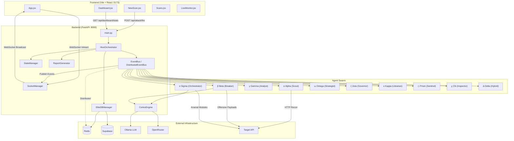
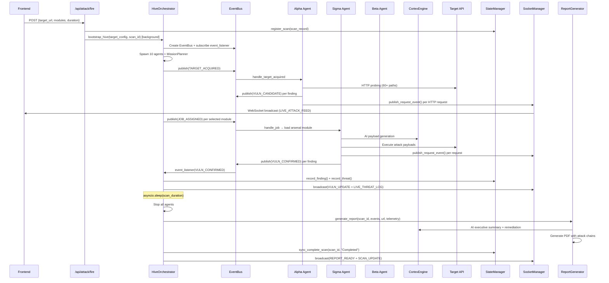

# Vulagent Scanner — Exhaustive Product Requirements Document (PRD)

> **Version**: v6.1-omega | **Codename**: Singularity V6  
> **Project Root**: `d:\Antigravity 2\API Endpoint Scanner`  
> **Repository**: [github.com/aniket2348823/Vul-Agent.git](https://github.com/aniket2348823/Vul-Agent.git)

---

## 1. Product Vision & Overview

**Vulagent Scanner** is an AI-powered, distributed API vulnerability assessment platform that autonomously discovers, exploits, and reports security vulnerabilities in web APIs. It operates as a **multi-agent swarm intelligence system** where 10+ specialized AI agents collaborate through an event-driven architecture to perform comprehensive security assessments.

### Core Capabilities
| Capability | Description |
|---|---|
| **Autonomous Scanning** | Full-lifecycle: Recon → Assessment → Exploitation → Reporting |
| **Multi-Agent Swarm** | 10 specialized agents coordinated via pub/sub EventBus |
| **Hybrid AI Engine** | Dual-core: GI5 deterministic engine + Ollama neural LLM |
| **Distributed Clustering** | Redis-backed Master/Worker architecture for horizontal scaling |
| **Real-Time Dashboard** | WebSocket-powered React SPA with live telemetry at ~50 FPS |
| **Forensic Reporting** | AI-generated PDF reports with attack chain analysis |
| **Browser Extension** | Chrome extension for live browser traffic interception |

---

## 2. Complete Technology Stack

### 2.1 Frontend
| Layer | Technology | Version | Purpose |
|---|---|---|---|
| Framework | React | ^18.2.0 | Component-based SPA |
| Build Tool | Vite | ^5.2.0 | HMR dev server + production bundling |
| Animation | Framer Motion | ^12.29.0 | Page transitions, micro-animations |
| Smooth Scroll | Lenis | ^1.3.17 | GPU-accelerated smooth scrolling |
| Styling | TailwindCSS | ^3.4.3 | Utility-first CSS framework |
| Metrics | web-vitals | ^5.1.0 | Core Web Vitals tracking |
| Fonts | Google Fonts | - | Inter, Space Grotesk, Material Symbols |

### 2.2 Backend
| Layer | Technology | Purpose |
|---|---|---|
| Framework | FastAPI | Async REST API + WebSocket server |
| Server | Uvicorn | ASGI server (port 8000) |
| Validation | Pydantic ≥2.0 | Request/response schema validation |
| WebSocket | websockets | Bi-directional real-time communication |
| HTTP Client | aiohttp / requests | Outbound HTTP for scanning |
| Browser Engine | Playwright + Stealth | Headless Chromium for DOM fuzzing |
| PDF Generation | fpdf2 | Professional forensic PDF reports |
| 2FA | pyotp + qrcode + Pillow | TOTP-based two-factor authentication |
| Process Monitoring | psutil | Memory/CPU watchdog for worker nodes |

### 2.3 AI / ML
| Component | Technology | Purpose |
|---|---|---|
| Cortex Engine (Core 1) | GI5 "Omega" | Deterministic: sanitization, deobfuscation, entropy analysis, sigmoid risk scoring (<1ms) |
| Cortex Engine (Core 2) | Ollama (local) | Neural: context-aware reasoning, creative payload generation (1-30s) |
| Fallback LLM | OpenRouter API | Cloud LLM when Ollama is offline |
| Graph Intelligence | NetworkX + Custom GraphEngine | Self-learning attack chain prediction |
| Risk Scoring | Bayesian Fusion + scikit-learn | Multi-source confidence scoring |
| Chain Analysis | Custom ChainAnalyzer | DFS-based multi-step attack path discovery |

### 2.4 Distributed Infrastructure
| Component | Technology | Purpose |
|---|---|---|
| Message Broker | Redis (pub/sub + queues) | Event distribution, job queues, distributed locking |
| Persistence | Supabase (PostgreSQL) | Vulnerability storage, task coordination, exploit evidence |
| Hot Cache | Redis SETNX | Deduplication, distributed task locks (TTL-based) |
| State | Local JSON (`stats.json`) | Scan state, metrics, history (atomic writes via tmp+rename) |

---

## 3. Project File Inventory

### 3.1 Root Level Files

| File | Size | Role |
|---|---|---|
| `index.html` | 315B | Vite HTML entry point, mounts React to `#root` |
| `package.json` | 971B | NPM config: name=`antigravity-scanner`, scripts: `dev`, `build`, `lint`, `preview` |
| `vite.config.js` | 523B | Proxy `/api` → `http://127.0.0.1:8000`, `/stream` → `ws://127.0.0.1:8000` |
| `requirements.txt` | 175B | 17 Python dependencies |
| `start_vulagent.bat` | 1083B | Windows launcher: starts backend + frontend + TestSprite |
| `stats.json` | 653B | Persisted scan state (metrics, history, scan records) |
| `graph.json` | 119KB | Self-learning intelligence graph (nodes + edges) |
| `keyring.json` | 239KB | Intercepted API keys/tokens from recon |
| `.env` | 645B | Environment: `SUPABASE_URL`, `SUPABASE_KEY`, `OPENROUTER_API_KEY`, `REDIS_URL` |

### 3.2 Backend Directory (`backend/`)

#### `backend/main.py` — Application Entry Point (179 lines)
- Creates FastAPI app with CORS (allow all origins)
- Mounts 5 API routers: `recon`, `attack`, `reports`, `defense`, `dashboard`
- Exposes dual WebSocket endpoints: `/stream` and `/ws/live`
- Contains `DistributedAttackCluster` for Master/Worker/Cluster modes
- CLI modes: `serve` (API), `master`, `worker`, `cluster`
- Lifespan: broadcasts lifecycle events, graceful shutdown

#### `backend/core/` — Core Engine Modules

| File | Lines | Role |
|---|---|---|
| `orchestrator.py` | 967 | **BRAIN**: `HiveOrchestrator.bootstrap_hive()` orchestrates entire scan lifecycle |
| `hive.py` | 338 | **NERVOUS SYSTEM**: `EventBus`, `DistributedEventBus`, `BaseAgent`, `EventType` enum |
| `state.py` | 272 | **MEMORY**: `StateManager` — thread-safe JSON persistence with background writer |
| `config.py` | 103 | **SETTINGS**: Singleton `ConfigManager` loading from `.env` |
| `reporting.py` | 873 | **VOICE**: `ReportGenerator` — AI-enhanced PDF forensic reports |
| `database.py` | 168 | **BACKBONE**: `EliteDBManager` — Supabase + Redis dual-layer persistence |
| `protocol.py` | 68 | **DNA**: Pydantic schemas: `JobPacket`, `ResultPacket`, `Vulnerability`, `AgentID` |
| `exploit_engine.py` | 419 | **AEEE**: Autonomous exploit verification with 5-layer signal detection |
| `graph_engine.py` | 281 | **INTELLIGENCE**: Self-learning graph with DFS chain discovery |
| `chain_analyzer.py` | 194 | **CORRELATOR**: Attack chain DFS with weighted confidence scoring |
| `planner.py` | 160 | **STRATEGIST**: 3-phase mission planner (Recon → Assessment → Exploitation) |
| `base.py` | ~100 | `BaseArsenalModule` — template for attack modules |
| `guard_layer.py` | ~150 | Safety controls and rate limiting |
| `mimic.py` | ~110 | Response mimicry and fingerprinting |
| `remediation.py` | ~270 | AI-powered fix suggestions |
| `risk_engine.py` | ~40 | CVSS-like risk calculation |
| `task_queue.py` | ~80 | Priority task queue management |
| `context.py` | ~15 | `ScanContext` dataclass for scan isolation |
| `memory.py` | ~10 | Shared memory primitives |
| `schema.sql` | 4KB | Supabase table definitions |

#### `backend/agents/` — 10 AI Agents

| Agent File | Codename | Role | Lines |
|---|---|---|---|
| `alpha.py` | **THE SCOUT** | Real-time HTTP recon, API endpoint discovery, path probing | 312 |
| `beta.py` | **THE BREAKER** | Heavy offensive: polyglot payloads, WAF mutation, AI-powered attacks | 341 |
| `gamma.py` | **THE ANALYST** | Forensic audit, response analysis, vulnerability classification | 80 |
| `sigma.py` | **THE ORCHESTRATOR** | Execution pipeline, hosts all 9 arsenal modules, AI payload generation | 359 |
| `omega.py` | **THE STRATEGIST** | Campaign strategy, attack chaining decisions | 100 |
| `zeta.py` | **THE GOVERNOR** | Rate limiting, throttling, governance, stealth mode | 150 |
| `kappa.py` | **THE LIBRARIAN** | Knowledge persistence, pattern memory, learning | 100 |
| `prism.py` | **THE SENTINEL** | Passive DOM analysis, prompt injection defense, cluster health watchdog | 281 |
| `chi.py` | **THE INSPECTOR** | Dark pattern detection, deceptive UI analysis | 240 |
| `delta.py` | **THE HYBRID** | Browser DOM controller via PinchTab engine | 110 |

#### `backend/ai/` — AI Intelligence Layer

| File | Lines | Role |
|---|---|---|
| `cortex.py` | 2410 | **CORTEX ENGINE**: Dual-core hybrid AI (GI5 deterministic + Ollama neural). Bayesian fusion, circuit breaker, telemetry. 40+ specialized methods. |
| `gi5.py` | ~600 | GI5 "Omega" deterministic engine core |
| `openrouter.py` | ~300 | OpenRouter API client (cloud LLM fallback) |

#### `backend/modules/` — 9 Arsenal Attack Modules

**Logic Modules** (`modules/logic/`):
| Module | Codename | Attack Category |
|---|---|---|
| `tycoon.py` | The Tycoon | Financial logic: negative quantities, integer overflow, floating point rounding |
| `escalator.py` | The Escalator | Mass assignment, privilege escalation, role elevation |
| `skipper.py` | The Skipper | Workflow bypass, multi-step sequence skipping |
| `doppelganger.py` | Doppelganger | IDOR detection, insecure direct object reference |
| `chronomancer.py` | Chronomancer | Race conditions, TOCTOU bugs |

**Technical Modules** (`modules/tech/`):
| Module | Attack Category |
|---|---|
| `sqli.py` | SQL injection: union-based, error-based, AI-generated payloads |
| `jwt.py` | JWT cracking: algorithm confusion, signature bypass |
| `fuzzer.py` | API fuzzing: parameter mutation, boundary testing |
| `auth_bypass.py` | Authentication bypass: header manipulation, token reuse |

#### `backend/api/` — API Layer

| File | Role |
|---|---|
| `socket_manager.py` | `SocketManager`: WebSocket connection pool, batch broadcasting at ~50 FPS, RPS tracking, adaptive sampling |
| `defense.py` | Extension defense API: DOM analysis dispatch to Prism/Chi agents |
| `endpoints/attack.py` | `POST /api/attack/fire` — Scan launch endpoint |
| `endpoints/recon.py` | `POST /api/recon/ingest` — Browser extension data ingestion, keyring management |
| `endpoints/reports.py` | PDF report serving, on-demand generation, consolidated reports |
| `endpoints/dashboard.py` | Stats, scan list, 2FA management, settings, auth flow |
| `endpoints/ai.py` | AI engine status and configuration |

#### `backend/schemas/payloads.py` — Request Schemas
- `ReconPayload`: url, method, headers, body, timestamp
- `AttackPayload`: target_url, method, headers, body, velocity, concurrency, rps, modules[], filters[], duration
- `TargetConfig`, `AttackConfig`: Internal routing schemas

#### `backend/reporting/`
| File | Role |
|---|---|
| `pdf_maker.py` | Low-level PDF rendering engine |
| `cvss_engine.py` | CVSS v3.1 score calculation |

### 3.3 Frontend Directory (`src/`)

| File | Lines | Role |
|---|---|---|
| `main.jsx` | 10 | React DOM root mount |
| `App.jsx` | 220 | Root component: routing, auth check, persistent dashboard state, global styles |
| `index.css` | ~100 | Base Tailwind imports + custom utilities |

#### `src/components/` — 13 UI Components

| Component | Lines | Role |
|---|---|---|
| `Dashboard.jsx` | ~564 | **COMMAND CENTER**: Real-time metrics, vulnerability graph (SVG), threat feed table, WebSocket consumer |
| `NewScan.jsx` | 480 | **MISSION CONFIG**: Target scope, 10 attack modules, 8 interception filters, performance sliders, auth config, extension toggle |
| `Scans.jsx` | ~400 | **SCAN HISTORY**: Active/completed scan list, PDF download buttons, status badges |
| `LiveMonitor.jsx` | ~160 | **FORENSIC STREAM**: Raw request/response table, real-time WebSocket ingestion |
| `Settings.jsx` | ~280 | **SETTINGS**: 2FA TOTP setup with QR code, dashboard reset |
| `Navigation.jsx` | ~70 | Tab bar: Dashboard, Scans, Library, Settings, Monitor |
| `Library.jsx` | ~120 | Arsenal module catalog and documentation |
| `Login.jsx` | ~90 | 2FA TOTP login gate |
| `ExplainabilityPanel.jsx` | ~120 | AI decision explainability overlay |
| `GlobalBackground.jsx` | ~40 | Animated star field background |
| `AnimationWrapper.jsx` | ~20 | Framer Motion page transition wrapper |
| `SmoothScroll.jsx` | ~10 | Lenis smooth scroll provider |
| `TiltCard.jsx` | ~50 | 3D tilt hover effect card |

---

## 4. Internal Architecture

### 4.1 System Architecture Diagram



### 4.2 Event-Driven Communication (EventBus)

The entire backend operates on a publish/subscribe event bus. All agents communicate exclusively through typed events — they never call each other directly.

#### Event Types (12 total)
| Event | Publisher | Subscribers | Purpose |
|---|---|---|---|
| `SYSTEM_START` | Orchestrator | All | System lifecycle notification |
| `LOG` | Any Agent | Logger | General logging |
| `TARGET_ACQUIRED` | Orchestrator | Alpha, Planner | New scan target URL |
| `VULN_CANDIDATE` | Alpha, Agents | Beta, Planner | Potential vulnerability found |
| `VULN_CONFIRMED` | Beta, Sigma, Prism | Orchestrator, Dashboard | Verified vulnerability |
| `AGENT_STATUS` | Any Agent | Dashboard | Agent online/offline |
| `JOB_ASSIGNED` | Orchestrator, Planner | Sigma, Beta, Prism, Chi | Task dispatch |
| `JOB_COMPLETED` | Any Agent | Planner, Beta | Task completion |
| `CONTROL_SIGNAL` | Zeta, Prism | Beta, All | Throttle/Stealth/Freeze/Resume |
| `LIVE_ATTACK` | Beta, Sigma | Dashboard | Real-time attack feed |
| `RECON_PACKET` | Alpha, Recon API | Dashboard | Recon data packet |
| `REPORT_READY` | Orchestrator | Dashboard | PDF report available |

#### Scan Context Isolation
Each scan gets its own `ScanContext` with:
- Dedicated `asyncio.Queue` for causal event ordering
- Deduplication window (1000-event FIFO with SHA set)
- Independent event loop task
- Garbage collection via `evict_scan_context()`

### 4.3 Data Flow Pipeline



---

## 5. External Architecture

### 5.1 Network Connectivity Map

```
┌──────────────────────────────────────────────────────────┐
│                    LOCAL MACHINE                          │
│                                                          │
│  ┌──────────┐   Proxy    ┌──────────────┐               │
│  │ Frontend │ ────────── │   Backend    │               │
│  │ :5173    │ /api→:8000 │   :8000      │               │
│  │ (Vite)   │ /stream→ws │  (Uvicorn)   │               │
│  └──────────┘            └──────────────┘               │
│       │                    │   │   │                     │
│       │ WebSocket          │   │   │                     │
│       └────────────────────┘   │   │                     │
│                                │   │                     │
│       ┌────────────────────────┘   │                     │
│       │                            │                     │
│  ┌────┴──────┐              ┌──────┴───────┐            │
│  │  Ollama   │              │   Redis      │            │
│  │  :11434   │              │   :6379      │            │
│  │  (Local   │              │  (Pub/Sub    │            │
│  │   LLM)    │              │   + Queues)  │            │
│  └───────────┘              └──────────────┘            │
└──────────────────────────────────────────────────────────┘
                    │                         │
        ┌───────────┘                         └──────────┐
        ▼                                                ▼
┌──────────────┐                              ┌──────────────┐
│  OpenRouter  │                              │   Supabase   │
│  (Cloud LLM  │                              │  (PostgreSQL │
│   Fallback)  │                              │    + REST)   │
└──────────────┘                              └──────────────┘
```

### 5.2 External Service Dependencies

| Service | Required? | Purpose | Connection |
|---|---|---|---|
| **Redis** | Optional | Distributed event bus, job queues, task locks, cluster telemetry | `redis://localhost:6379` |
| **Supabase** | Optional | Vulnerability persistence, task coordination, exploit evidence logging | HTTPS REST API |
| **Ollama** | Optional | Local LLM for context-aware payload generation and report writing | `http://localhost:11434/api/generate` |
| **OpenRouter** | Optional | Cloud LLM fallback when Ollama is unavailable | HTTPS API with API key |
| **Target API** | Required | The API being scanned (user-specified URL) | HTTP/HTTPS |

> **Graceful Degradation**: The system operates fully without Redis (standalone mode), without Supabase (local-only persistence), and without Ollama/OpenRouter (GI5 deterministic engine provides full functionality).

---

## 6. API Specification

### 6.1 REST Endpoints

#### `GET /api/health`
```json
Response: { "status": "online", "version": "v6.1-omega" }
```

#### `POST /api/attack/fire`
**Purpose**: Launch a new security scan
```json
Request: {
    "target_url": "https://api.example.com",
    "method": "POST",
    "headers": { "Authorization": "Bearer xxx" },
    "body": "",
    "velocity": 50,
    "concurrency": 50,
    "rps": 100,
    "modules": ["The Tycoon", "SQL Injection Probe"],
    "filters": ["Financial Logic", "PII Data"],
    "duration": 600
}
Response: {
    "status": "Swarm Online",
    "scan_id": "uuid-here",
    "message": "The Singularity has been unleashed..."
}
```

#### `GET /api/dashboard/stats`
**Purpose**: Dashboard metrics, graph data, threat feed
```json
Response: {
    "metrics": { "total_scans": 5, "active_scans": 1, "vulnerabilities": 12, "critical": 3 },
    "graph_data": [0, 0, 1, 3, 5, 8, 12],
    "recent_activity": [{ "text": "Scan Completed: https://...", "time": "2026-04-01 12:00:00", "type": "info" }],
    "historical_threats": [{ "timestamp": "12:00:05", "agent": "agent_sigma", "threat_type": "SQL_INJECTION", "url": "...", "severity": "HIGH", "risk_score": 75 }]
}
```

#### `GET /api/reports/pdf/{scan_id}`
**Purpose**: Serve or on-demand generate PDF report

#### `POST /api/defense/analyze`
**Purpose**: Browser extension threat analysis
```json
Request: { "agent_id": "agent_prism", "content": { "innerText": "...", "style": {} }, "url": "https://...", "session_id": "..." }
Response: { "verdict": "BLOCK" | "ALLOW", "reason": "Prompt Injection Signature", "risk_score": 95 }
```

#### `POST /api/recon/ingest`
**Purpose**: Ingest browser extension traffic data

#### `GET /api/dashboard/scans`
**Purpose**: List all scan records

#### Authentication Endpoints
- `GET /api/dashboard/auth/status` — Check 2FA requirement
- `POST /api/dashboard/auth/login` — TOTP verification
- `POST /api/dashboard/auth/logout` — Session invalidation
- `POST /api/dashboard/settings/2fa/generate` — Generate TOTP secret + QR
- `POST /api/dashboard/settings/2fa/verify` — Verify and enable 2FA

### 6.2 WebSocket Protocol

**Endpoints**: `/stream` or `/ws/live` (query param: `client_type=ui|spy`)

**Server → Client Message Types** (12):
| Type | Payload | Source |
|---|---|---|
| `SCAN_UPDATE` | `{id, status, target_url}` | Orchestrator |
| `VULN_UPDATE` | `{metrics: {vulnerabilities, critical, ...}, graph_data}` | Orchestrator |
| `LIVE_THREAT_LOG` | `{agent, threat_type, url, severity, timestamp, risk_score}` | Orchestrator |
| `LIVE_ATTACK_FEED` | `{timestamp, agent, method, endpoint, url, severity, risk_score, status, result, arsenal, action}` | SocketManager |
| `RECON_PACKET` | `{url, severity, risk_score, source, timestamp}` | Recon API |
| `JOB_ASSIGNED` | `{source, url, module, timestamp}` | Orchestrator |
| `REPORT_READY` | `{id}` | Orchestrator |
| `GI5_LOG` | `string message` | Orchestrator |
| `SPY_STATUS` | `{connected: boolean}` | SocketManager |
| `LIFECYCLE_EVENT` | `{state, mode}` | Lifespan |
| `KEY_CAPTURE` | `{url, keys, timestamp}` | Recon API |
| `CLUSTER_TELEMETRY` | `{scan_id, workers_active, queue_depth, audit_depth, timestamp}` | Orchestrator |

---

## 7. Distributed Cluster Architecture

### 7.1 Master Node (`MasterNode`)
- Connects to Redis, discovers workers via `HGETALL workers`
- Polls `pending_tasks` queue via `BRPOP`
- Distributes tasks to optimal worker based on specialty and load
- Monitors worker heartbeats (3-minute timeout)
- Reassigns tasks from dead workers

### 7.2 Worker Node (`WorkerNode`)
- Registers with Redis heartbeat every 30 seconds
- Polls personal queue `worker_queue:{id}` via `BRPOP`
- Memory guard: pauses when `psutil.virtual_memory().percent > 85%`
- Dynamic module execution via `importlib.import_module()`
- Each worker can spin up a `PinchTabInstance` (headless Chromium)

### 7.3 PinchTab Browser Instance
- Isolated Chromium profiles per worker
- Semantic DOM step execution (input, click)
- Cookie/localStorage/sessionStorage extraction
- XSS reflection detection
- Auto-cleanup of browser profiles on shutdown

---

## 8. AI Cortex Engine (2,410 lines)

### 8.1 Dual-Core Architecture
```
┌─────────────────────────────────────────┐
│           CORTEX ENGINE                  │
│                                          │
│  ┌──────────────┐  ┌──────────────────┐ │
│  │   CORE 1     │  │     CORE 2       │ │
│  │  GI5 "Omega" │  │  Neural Engine   │ │
│  │  (Instant)   │  │  (Ollama/OR)     │ │
│  │              │  │                  │ │
│  │  - Sanitize  │  │  - Context-aware │ │
│  │  - Deobfusc  │  │  - Creative gen  │ │
│  │  - Entropy   │  │  - Semantic      │ │
│  │  - Sigmoid   │  │  - NLU           │ │
│  │  - Patterns  │  │                  │ │
│  └───────┬──────┘  └────────┬─────────┘ │
│          │                  │            │
│          └───────┬──────────┘            │
│                  ▼                       │
│       ┌──────────────────┐               │
│       │ Bayesian Fusion  │               │
│       │ (Weighted Merge) │               │
│       └──────────────────┘               │
└─────────────────────────────────────────┘
```

### 8.2 Key Methods (40+)
- `generate_sqli_payloads()` — AI-powered SQL injection payload generation
- `generate_financial_vectors()` — Financial logic attack vectors
- `detect_prompt_injection()` — Semantic injection analysis
- `assess_contextual_risk()` — Dynamic risk scoring
- `generate_executive_summary()` — AI report writing
- `generate_remediation()` — Fix suggestions per vulnerability
- `classify_response()` — Response analysis and categorization

### 8.3 Circuit Breaker
- Tracks consecutive failures
- Auto-disables neural core after threshold
- Recovers after cooldown period
- Telemetry: `llm_calls`, `avg_llm_latency`, `circuit_breaker_trips`

---

## 9. Reporting Pipeline

### 9.1 Report Generation Flow
1. Orchestrator collects all `scan_events` during the scan
2. `ReportGenerator.generate_report()` is called in a background task
3. Cortex AI generates executive summary, remediation, and risk analysis
4. `ChainAnalyzer` builds multi-step attack paths via DFS
5. `SecurityReportPDF` (fpdf2) renders professional PDF with:
   - Cover page with scan metadata
   - Executive summary (AI-written)
   - Vulnerability table with CVSS scores
   - Attack chain visualization
   - Individual finding details with evidence
   - Remediation recommendations
   - Telemetry appendix
6. PDF saved to `reports/Scan_Report_{scan_id}.pdf`

### 9.2 Report Color Palette
| Color | Hex | Usage |
|---|---|---|
| Pure Red | `#C0392B` | Main titles |
| Dark Blue | `#2C3E50` | Section titles |
| Accent Purple | `#9B61FF` | Borders & indicators |
| Critical Red | `#EF4444` | Alert severity |
| Warning Orange | `#F59E0B` | Warning severity |
| Success Green | `#10B981` | Success indicators |

---

## 10. State Management

### 10.1 Frontend State Architecture
- **App.jsx**: Owns `dashboardState` (metrics, graph_data, threat_feed, activeScanId)
- **Dashboard.jsx**: Receives `persistentState` + `setPersistentState` as props
- **WebSocket**: Each component manages its own WebSocket connection
- **Navigation**: Simple `currentPage` state with `navigate()` function

### 10.2 Backend State Architecture
- **StateManager** (`stats.json`): Singleton, thread-safe with `asyncio.Lock` + `threading.Lock`
  - Background writer: flushes every 2 seconds if dirty
  - Atomic writes: write to `.tmp` then `os.replace()`
  - Deduplication: SHA256 signature-based per scan
- **EliteDBManager**: Lazy-init Supabase + Redis connections
  - Vulnerability deduplication: Redis hot-cache + Supabase ON CONFLICT
  - Distributed task locks: Redis SETNX with 600s TTL

---

## 11. Security Features

| Feature | Implementation |
|---|---|
| **2FA Authentication** | TOTP via `pyotp`, QR code generation via `qrcode` |
| **Session Management** | In-memory session state (resets on server restart) |
| **CORS** | Open (`*`) — intended for local-only deployment |
| **Exploit Safety** | Domain whitelist (`localhost`, `127.0.0.1`, `0.0.0.0`, `test-env.local`) |
| **Rate Limiting** | `MAX_REQUESTS_PER_CHAIN = 10`, `MAX_CONCURRENT_EXPLOITS = 3` |
| **5xx Abort** | Auto-abort on server errors to prevent target damage |
| **Memory Guard** | Workers pause when RAM > 85% |
| **Event Deduplication** | 1000-event sliding window with SHA-based signatures |

---

## 12. TestSprite MCP Testing Configuration

### 12.1 Project Details for TestSprite

| Parameter | Value |
|---|---|
| **Project Name** | `API Endpoint Scanner` |
| **Project Path** | `d:\Antigravity 2\API Endpoint Scanner` |
| **Type** | `frontend` (React SPA with backend API) |
| **Local Port** | `5173` (Vite dev server) |
| **Backend Port** | `8000` (FastAPI/Uvicorn) |
| **Test Scope** | `codebase` |
| **Pathname** | `` (empty — SPA with client-side routing) |

### 12.2 How to Start the Project for Testing

```bash
# Terminal 1: Start Backend
cd "d:\Antigravity 2\API Endpoint Scanner"
python -m backend.main

# Terminal 2: Start Frontend
cd "d:\Antigravity 2\API Endpoint Scanner"
npm run dev
```

Or use the unified launcher:
```bash
start_vulagent.bat
```

### 12.3 Critical Pages/Routes (Client-Side)

| Page | Navigation State | Key UI Elements |
|---|---|---|
| **Dashboard** | `currentPage = 'dashboard'` | Metric cards, SVG graph, threat feed table |
| **New Scan** | `currentPage = 'newscan'` | Target input, module checkboxes, performance sliders, Launch button |
| **Scans** | `currentPage = 'scans'` | Scan list table, PDF download buttons, status badges |
| **Settings** | `currentPage = 'settings'` | 2FA setup, QR code, dashboard reset |
| **Library** | `currentPage = 'library'` | Arsenal module catalog |
| **Login** | Shown when `isLocked = true` | TOTP input field |

### 12.4 Key User Flows for Testing

1. **Launch Scan Flow**: Dashboard → Click "New Scan" → Enter target URL → Select modules → Click "Launch Scan" → Redirect to Scans → Verify scan appears with "Running" status
2. **Dashboard Monitoring**: Dashboard → Verify metrics update via WebSocket → Verify graph renders → Verify threat feed populates
3. **Report Download**: Scans → Click PDF download on completed scan → Verify PDF downloads
4. **2FA Setup**: Settings → Click "Enable 2FA" → Scan QR code → Enter TOTP → Verify enabled
5. **Auth Flow**: When 2FA enabled → Login page shown → Enter TOTP → Access granted

### 12.5 Backend API Dependencies for Frontend Testing

> [!IMPORTANT]
> The frontend makes direct API calls to `http://127.0.0.1:8000`. The Vite proxy forwards `/api/*` and `/stream` WebSocket connections. **Both backend and frontend must be running** for frontend tests to function properly.

### 12.6 Key Test Assertions

| Area | What to Test |
|---|---|
| **Navigation** | All 5 tabs navigate correctly without page reload |
| **WebSocket** | Connection established to `/stream`, messages received |
| **Dashboard Persistence** | Metrics survive navigation between tabs |
| **Scan Launch** | POST to `/api/attack/fire` returns 200 with `scan_id` |
| **Module Selection** | Checkboxes toggle correctly, count updates |
| **Performance Sliders** | Range inputs update displayed values |
| **Auth Gate** | Login page blocks access when 2FA enabled |
| **Report Download** | PDF link is active only after `report_ready = true` |
| **Responsive Layout** | Glassmorphism cards render on desktop viewport |

### 12.7 Environment Variables Required

```env
SUPABASE_URL=https://xxx.supabase.co
SUPABASE_KEY=eyJxxx
OPENROUTER_API_KEY=sk-or-xxx
REDIS_URL=redis://localhost:6379
```

> [!NOTE]
> All external services (Supabase, Redis, Ollama, OpenRouter) are **optional**. The application operates in standalone mode without them. For testing purposes, the backend will start and serve the health endpoint even without these configured.

---

## 13. Known Constraints & Limitations

| Constraint | Details |
|---|---|
| **Windows Only** | `start_vulagent.bat` is Windows-specific; `sys.platform == 'win32'` encoding fix |
| **Local Deployment** | CORS `*` and direct `127.0.0.1:8000` references assume local-only |
| **No Auth on WebSocket** | WebSocket endpoints have no authentication |
| **In-Memory Session** | 2FA session resets on server restart |
| **JSON State File** | `stats.json` is a single-file database — not suitable for production scale |
| **Browser Extension** | Required for live browser traffic interception (optional feature) |
| **Ollama Required for AI** | Full AI features require Ollama running locally on port 11434 |

---

## 14. Glossary

| Term | Definition |
|---|---|
| **Hive** | The collective agent swarm system |
| **EventBus** | Pub/sub message broker connecting all agents |
| **Cortex** | Hybrid AI engine (GI5 + Neural) |
| **PinchTab** | Headless browser instance for DOM fuzzing |
| **Arsenal** | Collection of attack modules (9 total) |
| **GI5** | Deterministic AI core (instant, no network) |
| **Singularity** | Codename for the unified scan orchestration system |
| **Xytherion** | Codename for the distributed cluster architecture |
| **GraphEngine** | Self-learning vulnerability relationship graph |
| **AEEE** | Autonomous Exploit Execution Engine |
